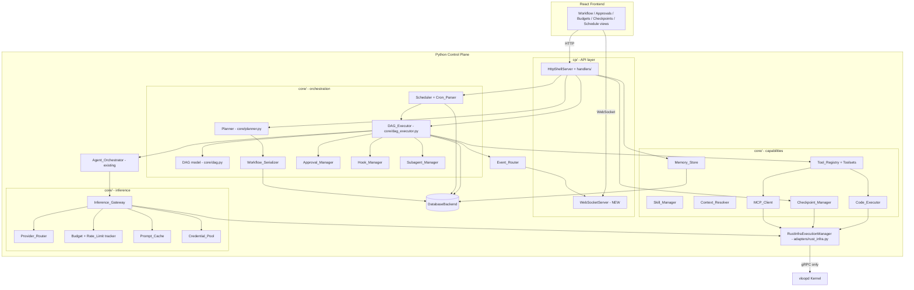
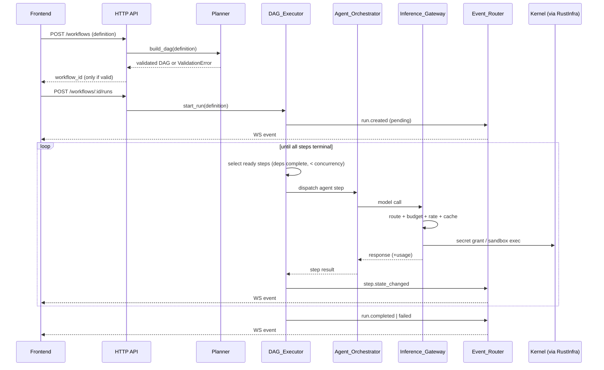
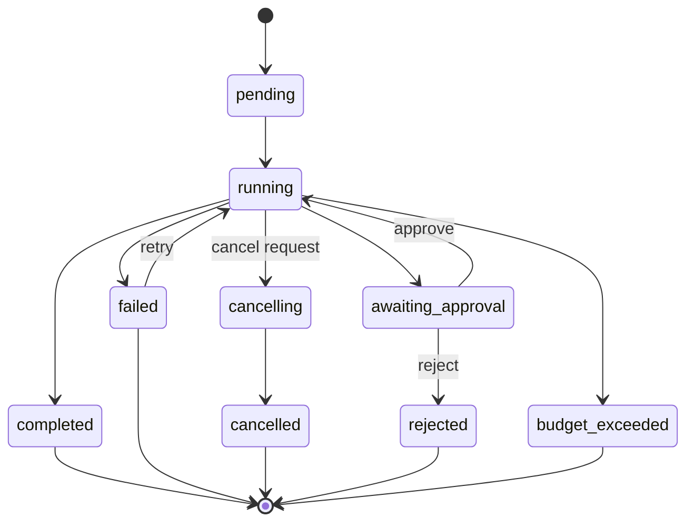
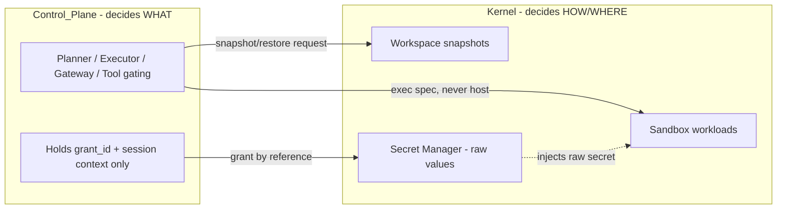

# Design Document

## Overview

This feature completes the VLoop orchestration engine (build roadmap Stage 6) and selectively extends it with the highest-value, sandbox-safe capabilities described in the requirements. It builds out the previously-scaffolded `core/planner.py` and `core/dag.py`, fleshes out `adapters/rust_infra.py`, and introduces a set of new Control_Plane subsystems (Inference_Gateway, Provider_Router, Approval_Manager, Event_Router, Tool_Registry, Skill_Manager, Memory_Store, Context_Resolver, Checkpoint_Manager, Scheduler/Cron_Parser, Subagent_Manager, Code_Executor, Hook_Manager, MCP_Client, Workflow_Serializer).

The design honors the architecture boundary defined in `docs/fix-plan.md` and `docs/control-plane.md`: the **Control_Plane decides WHAT** happens, and the **Kernel decides HOW and WHERE** it runs. Every new subsystem lives in the Python Control_Plane and reaches infrastructure only through the kernel gRPC client. All code execution and filesystem mutation are routed exclusively through Kernel-managed Sandboxes (workloads). Secrets are obtained as kernel grants and never read as raw values into Control_Plane state. The Frontend (today a polling React app) gains a new WebSocket channel for live workflow events, but still talks only to Control_Plane APIs.

### Goals

- Build a Planner that compiles and validates a Workflow_Definition into a DAG without side effects.
- Build a DAG_Executor that schedules steps by dependency edges and concurrency limit, persists step state for restart survival, and supports cancel and retry.
- Centralize all model calls behind an Inference_Gateway with routing, fallback, retries, budgets, rate limits, credential pools, and prompt caching.
- Add approvals, tools/toolsets, skills, bounded memory, context references, checkpoints, scheduling, subagents, sandboxed code execution, event hooks, and MCP integration.
- Stream workflow state to the Frontend over WebSocket and expose REST APIs for guided non-technical operation.
- Keep all execution sandboxed, redact secrets, and make every event auditable per run.

### Non-Goals (Requirement 21)

Voice mode, vision/image input, browser automation, Kubernetes backends, and distributed swarm execution are explicitly out of scope. No host execution path is provided; if sandbox routing fails, execution is blocked rather than falling back to the host.

### Key Design Decisions

| Decision | Rationale |
|---|---|
| Persist all new state through the existing `DatabaseBackend` abstraction (`core/database.py`) | One persistence path across SQLite/Postgres/DuckDB; restart survival for runs, steps, schedules, memory. |
| Workflow_Definition serialized as canonical JSON with sorted keys | Deterministic round-trip (Req 2.3); reuses `core/helpers.to_json`/`from_json`. |
| Inference_Gateway wraps the existing `ProviderService`/`agent_invoker` rather than replacing them | Preserves existing provider CRUD and DSPy invocation; adds policy as a layer. |
| New WebSocket server runs alongside the existing threaded `HttpShellServer` | Frontend currently polls; a push channel is needed for step transitions, approvals, budget/rate events (Req 4.1, 7.5, 8.2). |
| `RustInfraExecutionManager` becomes the single chokepoint for all kernel-backed execution (sandbox exec, snapshot/restore, secret grants) | Enforces the "no host execution" invariant (Req 21.1/21.2) in one place. |
| Secrets referenced by `grant_id`/session context only | Honors `docs/secret-manager.md`; satisfies Req 6.5, 16.4, 18.4. |

---

## Architecture

### Component Placement (C4 Level 3, Control_Plane)



### Workflow Execution Sequence



### Run State Machine



### Trust and Execution Boundary



---

## Components and Interfaces

The new code maps onto the existing package layout as follows. `core/` modules hold domain logic (DB-only I/O), `cp/` holds API/runtime wiring, and `adapters/` holds the kernel-backed execution adapter.

| Subsystem | New/changed module | Notes |
|---|---|---|
| Planner | `core/planner.py` (flesh out) | DAG build + validation, no side effects |
| DAG model | `core/dag.py` (flesh out) | Node/edge types, topological helpers, cycle detection |
| DAG_Executor | `core/dag_executor.py` (new) | Scheduling, concurrency, persistence, cancel/retry |
| Workflow_Serializer | `core/workflow_serializer.py` (new) | Canonical JSON round-trip |
| Inference_Gateway | `core/inference_gateway.py` (new) | Wraps ProviderService; routing/budget/rate/cache/pool |
| Provider_Router | `core/provider_router.py` (new) | Policy-based selection + fallback order |
| Approval_Manager | `core/approval_manager.py` (new) | Pause/resume/reject checkpoints |
| Tool_Registry | `core/tool_registry.py` (new) | Tool/Toolset catalog + scope gating |
| Skill_Manager | `core/skill_manager.py` (new) | agentskills.io parsing, progressive disclosure |
| Memory_Store | `core/memory_store.py` (new) | Bounded persistent memory |
| Context_Resolver | `core/context_resolver.py` (new) | `@`-reference resolution via kernel FS |
| Checkpoint_Manager | `core/checkpoint_manager.py` (new) | Snapshot/restore requests to kernel |
| Scheduler + Cron_Parser | `core/scheduler.py`, `core/cron_parser.py` (new) | Cron round-trip + trigger loop |
| Subagent_Manager | `core/subagent_manager.py` (new) | Bounded child agent spawning |
| Code_Executor | `core/code_executor.py` (new) | Sandboxed script execution |
| Hook_Manager | `core/hook_manager.py` (new) | Lifecycle event hooks + guardrails |
| MCP_Client | `core/mcp_client.py` (new) | MCP server connection + tool registration |
| Event_Router | `core/event_router.py` (new); extends `cp/events.py` | Internal + kernel events → WS |
| WebSocket server | `cp/ws_server.py` (new) | Push channel alongside `cp/http_server.py` |
| HTTP routes | `cp/handlers/workflows.py`, `schedules.py`, `memory.py`, `checkpoints.py`, `tools.py`, `mcp.py` (new) | Registered via `cp/handlers/router.py` |
| Kernel adapter | `adapters/rust_infra.py` (flesh out) | Sandbox exec, snapshot/restore, secret grants |

### Planner (`core/planner.py`)

```python
class ValidationError(Exception):
    """Raised when a Workflow_Definition is invalid. Carries machine-readable detail."""
    def __init__(self, code: str, message: str, detail: dict[str, Any]) -> None: ...

class Planner:
    def __init__(self, registry: ReferenceResolver) -> None: ...

    def build_dag(self, definition: dict[str, Any]) -> "Dag":
        """Compile a definition into a validated DAG.
        Pure: dispatches no model call and no kernel workload (Req 1.5).
        Raises ValidationError on cycle (Req 1.2) or missing reference (Req 1.3)."""

    def validate(self, definition: dict[str, Any]) -> list[dict[str, Any]]:
        """Return a list of validation problems (empty = valid). Side-effect free."""
```

`ReferenceResolver` checks that referenced agents/tools/inputs exist using `AgentOrchestrator`, `Tool_Registry`, and the definition's declared inputs. The Planner never persists; the caller (HTTP handler) persists only when `build_dag` succeeds, ensuring rejected definitions get no id (Req 1.2, 1.3, 1.4).

### DAG model (`core/dag.py`)

```python
@dataclass(frozen=True)
class DagNode:
    step_id: str
    step_type: str          # "agent" | "tool" | "approval" | "subworkflow"
    config: dict[str, Any]
    depends_on: tuple[str, ...]

@dataclass(frozen=True)
class Dag:
    nodes: dict[str, DagNode]
    edges: tuple[tuple[str, str], ...]   # (from_step, to_step)

    def detect_cycle(self) -> list[str] | None:  # returns cycle path or None
    def topological_layers(self) -> list[list[str]]:
    def dependents_of(self, step_id: str) -> set[str]:  # transitive
    def roots(self) -> list[str]:
```

### DAG_Executor (`core/dag_executor.py`)

```python
class DagExecutor:
    def __init__(self, state: DatabaseBackend, agents: AgentOrchestrator,
                 gateway: InferenceGateway, tools: ToolRegistry,
                 approvals: ApprovalManager, hooks: HookManager,
                 events: EventRouter, infra: RustInfraExecutionManager,
                 concurrency_limit: int) -> None: ...

    def start_run(self, definition_id: str) -> str:           # Req 3.1 -> run_id, pending
    def _schedule_ready(self, run_id: str) -> None:           # Req 3.2, 3.3, 3.4
    def _on_step_complete(self, run_id: str, step_id: str, result: StepResult) -> None:
    def cancel_run(self, run_id: str) -> None:                # Req 4.2, 4.3
    def retry_run(self, run_id: str) -> None:                 # Req 4.4
    def get_run(self, run_id: str) -> dict[str, Any]          # Req 4.5
    def resume_pending_runs(self) -> None:                    # restart recovery (Req 3.7, 8.5)
```

Scheduling rule: a step becomes *ready* only when every `depends_on` step is in a `completed` state; ready steps run up to `concurrency_limit` (Req 3.2–3.4). Run outcome is derived only from success-vs-error of *relevant* steps; `cancelled`/`skipped` steps do not flip completed↔failed (Req 3.5, 3.6). Each step transition is persisted before the next is scheduled so a restart can rebuild in-flight state (Req 3.7) and resume awaiting-approval runs (Req 8.5). Cancellation stops new scheduling and calls `infra.teardown` for in-flight workloads, reaching `cancelled` within 10s (Req 4.2, 4.3). Retry re-runs error steps plus their transitive dependents while preserving successful step outputs (Req 4.4).

### Inference_Gateway (`core/inference_gateway.py`) + Provider_Router

```python
class InferenceGateway:
    def __init__(self, providers: ProviderService, router: ProviderRouter,
                 budgets: BudgetTracker, limiter: RateLimiter,
                 cache: PromptCache, pools: CredentialPoolManager,
                 infra: RustInfraExecutionManager, events: EventRouter) -> None: ...

    def call(self, request: ModelRequest, scope: RunScope) -> ModelResponse:
        """Single entry point for all model calls (Req 6.1).
        Cache lookup (Req 19.4) -> budget check (Req 7.1,7.2) -> rate limit (Req 7.4)
        -> credential grant/pool (Req 6.5, 19.2) -> provider call with retry (Req 6.2)
        -> fallback (Req 6.3) -> exhaustion error (Req 6.4)."""

class ProviderRouter:
    def select(self, policy: RoutingPolicy, health: ProviderHealth) -> list[str]:
        """Ordered provider/model candidates honoring cost|speed|quality preference
        (Req 19.1) and configured fallback order (Req 6.3)."""
```

Retry uses exponential backoff and is attempted up to and including the configured maximum retry count (Req 6.2). Budget check failure (state unavailable) is fail-open: the call proceeds, rate-limit delays are disabled for that call, and the skipped check is recorded (Req 7.3). Exceeding budget blocks the call and transitions the run to `budget_exceeded` (Req 7.2). Credentials come only from kernel grants; only the granted session context is cached, never raw secret values (Req 6.5). Credential pools rotate grants across calls and quarantine rejected grants (Req 19.2, 19.3).

### Approval_Manager (`core/approval_manager.py`)

```python
class ApprovalManager:
    def enter_checkpoint(self, run_id: str, step_id: str, context: dict) -> None:  # Req 8.1, 8.2
    def approve(self, run_id: str, step_id: str, edits: dict | None) -> None:      # Req 8.3
    def reject(self, run_id: str, step_id: str, reason: str) -> None:              # Req 8.4
    def pending_for_run(self, run_id: str) -> list[dict]:
```

Sets the step to `awaiting-approval`, persists it (survives restart, Req 8.5), emits an `approval-required` event with context (Req 8.2), and resumes or terminates the run on decision.

### Tool_Registry (`core/tool_registry.py`)

```python
class ToolRegistry:
    def register_tool(self, tool: ToolSpec) -> None
    def register_toolset(self, toolset: ToolsetSpec) -> None
    def is_enabled(self, tool_name: str, scope: ToolScope) -> bool   # Req 9.2, 9.3
    def invoke(self, tool_name: str, args: dict, scope: ToolScope) -> ToolResult  # Req 9.4, 9.5
```

`ToolScope` carries both agent-level and run-level enable/disable maps; agent-level disable takes precedence (Req 9.3). Denied invocations are recorded in the run event history (Req 9.4). Any tool performing filesystem mutation or command execution is routed through a Kernel-managed Sandbox via `Code_Executor`/`RustInfra` (Req 9.5).

### Skill_Manager (`core/skill_manager.py`)

Maintains a catalog where every skill always contributes its name + short description to context (Req 10.2); full body is loaded only when relevance is determined (Req 10.3). Parses agentskills.io documents (Req 10.4). Parsing that fails due to corruption/encoding still loads the raw content rather than dropping the skill (Req 10.5).

### Memory_Store (`core/memory_store.py`)

Persists curated entries across sessions (Req 11.1), enforces a configured max total size with curation (reject/remove) when exceeded (Req 11.2), removes entries from persistence on delete independent of any completion flag and returns a descriptive error if deletion cannot complete (Req 11.3), and exposes a list API (Req 11.4).

### Context_Resolver (`core/context_resolver.py`)

Resolves `@`-prefixed references (file/folder/git diff/URL) into concrete text via kernel-managed filesystem access (Req 12.1, 12.2). Unresolvable references inject a descriptive placeholder and processing continues for the rest (Req 12.3). Auto-discovers designated project context files on entering a project directory (Req 12.4).

### Checkpoint_Manager (`core/checkpoint_manager.py`)

Requests a kernel snapshot before any sandbox filesystem mutation (Req 13.1), requests restore on rollback (Req 13.2), lists checkpoints for a run (Req 13.3). The kernel owns snapshot storage; the CP stores only checkpoint metadata/pointers, treats zero-checkpoint state as valid, and never stores snapshot file contents (Req 13.4).

### Scheduler + Cron_Parser (`core/scheduler.py`, `core/cron_parser.py`)

Scheduler persists Workflow_Definition↔schedule associations in active or paused state (Req 14.1), starts runs when the clock matches (Req 14.2), and stops a paused task from triggering (Req 14.3). Cron_Parser parses cron expressions to a `Schedule` and formats back, guaranteeing the round-trip property (Req 14.4). Invalid expressions are rejected with a descriptive error (Req 14.5).

### Subagent_Manager (`core/subagent_manager.py`)

Spawns subagents with isolated context (Req 15.1), restricts each to the toolset granted at spawn (Req 15.2), queues requests beyond the concurrency limit (Req 15.3), and on completion returns the result to the parent and records token usage against the run (Req 15.4).

### Code_Executor (`core/code_executor.py`)

Submits scripts to a Kernel-managed Sandbox only — never the host (Req 16.1, 21.1). Returns captured stdout/stderr/exit code (Req 16.2). Enforces a time limit by requesting workload termination and returning a timeout error (Req 16.3). Grants the sandbox only the toolset and secret grants configured for the enclosing run (Req 16.4). If sandbox routing fails, execution is blocked with no host fallback (Req 21.2).

### Hook_Manager (`core/hook_manager.py`)

Registers Event_Hooks against lifecycle events (Req 17.1), runs them with event context and lets non-blocking hooks not block the run (Req 17.2), records hook errors and continues unless the hook is a blocking guardrail (Req 17.3), and stops the associated step when a blocking guardrail denies the action (Req 17.4).

### MCP_Client (`core/mcp_client.py`)

Connects over the configured transport and registers server tools into the Tool_Registry (Req 18.1), applies per-server tool filters (Req 18.2), marks tools unavailable and records disconnection when a server is unreachable (Req 18.3), obtains credentials only via kernel grants (Req 18.4), and lets the connection fail rather than falling back to raw CP secrets when no grant is available (Req 18.5).

### Event_Router (`core/event_router.py`) + WebSocket server (`cp/ws_server.py`)

Extends the existing kernel `KernelEventRouter` to also accept internal orchestration events, normalizes them into user-facing workflow events, attaches the `Workflow_Run` id to every event (Req 21.5), redacts secret values (Req 21.4), and streams to the Frontend over a new WebSocket channel (Req 4.1, 7.5, 8.2). The WebSocket server runs alongside `HttpShellServer`.

### RustInfraExecutionManager (`adapters/rust_infra.py`)

Becomes the single kernel-backed execution chokepoint, implementing `IExecutionManager` plus snapshot and grant methods:

```python
class RustInfraExecutionManager(IExecutionManager):
    def dispatch_job(self, spec, policy) -> str          # sandbox exec (new gRPC: WorkloadControl.Exec)
    def stream_logs(self, job_id)                         # WatchWorkloadLogs (exists)
    def teardown(self, job_id) -> None                    # StopWorkload/DestroyWorkload (exists)
    def snapshot_workspace(self, workspace_id) -> str     # NEW gRPC: FilesystemControl.Snapshot
    def restore_workspace(self, workspace_id, snap) -> None  # NEW gRPC: FilesystemControl.Restore
    def request_secret_grant(self, secret_ref, target) -> GrantContext  # SecretControl.Grant
```

### Kernel gRPC Contract Surface: New vs. Existing

| Capability | Status | gRPC surface |
|---|---|---|
| Workload create/start/stop/logs | Exists (`cp/workloads.py`, `kernel_pb2`) | `WorkloadControl` |
| Sandbox script exec (stdout/stderr/exit) | **NEW** | `WorkloadControl.Exec` (or exec-in-workload RPC) |
| Workspace snapshot / restore for checkpoints | **NEW** | `FilesystemControl.Snapshot` / `.Restore` |
| Secret grant for provider sessions / credential pools | **NEW (CP consumption)** | `SecretControl.Grant` / `.Revoke` |
| Secret grant for MCP server credentials | **NEW (CP consumption)** | `SecretControl.Grant` |
| Kernel event subscription | Exists | `KernelLifecycle` event watch |

CP-only (no new kernel surface): Planner, DAG_Executor scheduling/state, Workflow_Serializer, Provider_Router policy, Budget/Rate/Cache/Pool bookkeeping, Approval_Manager, Tool_Registry gating, Skill_Manager, Memory_Store, Scheduler/Cron_Parser, Hook_Manager, Subagent_Manager logic, Event_Router normalization, WebSocket server.

---

## Data Models

All tables are added to `_SCHEMA_STATEMENTS` in `core/database.py` and accessed via the existing `DatabaseBackend` methods (`fetch_all`/`fetch_one`/`execute`/`executemany`). JSON columns use `core/helpers.to_json`/`from_json`.

### Workflow definitions and runs

```sql
CREATE TABLE IF NOT EXISTS workflow_definitions (
    id TEXT PRIMARY KEY,
    name TEXT NOT NULL,
    objective TEXT,
    definition_json TEXT NOT NULL,   -- canonical serialized Workflow_Definition
    revision INTEGER NOT NULL,
    created_at TEXT NOT NULL,
    updated_at TEXT NOT NULL
);

CREATE TABLE IF NOT EXISTS workflow_runs (
    id TEXT PRIMARY KEY,
    definition_id TEXT NOT NULL,
    state TEXT NOT NULL,             -- pending|running|awaiting_approval|completed|failed|cancelling|cancelled|rejected|budget_exceeded
    concurrency_limit INTEGER NOT NULL,
    budget_json TEXT,                -- limits + cumulative usage
    created_at TEXT NOT NULL,
    started_at TEXT,
    finished_at TEXT
);

CREATE TABLE IF NOT EXISTS workflow_steps (
    run_id TEXT NOT NULL,
    step_id TEXT NOT NULL,
    step_type TEXT NOT NULL,
    state TEXT NOT NULL,             -- pending|ready|running|awaiting_approval|completed|failed|cancelled|skipped
    depends_on_json TEXT NOT NULL,
    inputs_json TEXT,
    output_json TEXT,
    error_message TEXT,
    started_at TEXT,
    finished_at TEXT,
    PRIMARY KEY (run_id, step_id)
);

CREATE TABLE IF NOT EXISTS workflow_events (
    run_id TEXT NOT NULL,
    seq INTEGER NOT NULL,
    type TEXT NOT NULL,
    step_id TEXT,
    message TEXT NOT NULL,
    payload_json TEXT NOT NULL,      -- secret-redacted
    created_at TEXT NOT NULL,
    PRIMARY KEY (run_id, seq)
);
```

### Scheduling, memory, checkpoints, tools, MCP

```sql
CREATE TABLE IF NOT EXISTS scheduled_tasks (
    id TEXT PRIMARY KEY,
    definition_id TEXT NOT NULL,
    cron_expression TEXT NOT NULL,
    state TEXT NOT NULL,             -- active|paused
    next_run_at TEXT,
    created_at TEXT NOT NULL,
    updated_at TEXT NOT NULL
);

CREATE TABLE IF NOT EXISTS memory_entries (
    id TEXT PRIMARY KEY,
    category TEXT NOT NULL,          -- preference|project|environment
    content TEXT NOT NULL,
    size_bytes INTEGER NOT NULL,
    created_at TEXT NOT NULL,
    updated_at TEXT NOT NULL
);

CREATE TABLE IF NOT EXISTS checkpoints (
    id TEXT PRIMARY KEY,
    run_id TEXT NOT NULL,
    workspace_id TEXT NOT NULL,
    kernel_snapshot_ref TEXT NOT NULL,   -- pointer only; kernel owns contents
    created_at TEXT NOT NULL
);

CREATE TABLE IF NOT EXISTS toolsets (
    id TEXT PRIMARY KEY,
    name TEXT NOT NULL,
    tools_json TEXT NOT NULL,
    created_at TEXT NOT NULL
);

CREATE TABLE IF NOT EXISTS mcp_servers (
    id TEXT PRIMARY KEY,
    name TEXT NOT NULL,
    transport TEXT NOT NULL,
    tool_filter_json TEXT,
    grant_ref TEXT,                  -- secret grant reference, never raw value
    status TEXT NOT NULL,            -- connected|unreachable
    created_at TEXT NOT NULL
);
```

### In-memory model types

```python
@dataclass
class ModelRequest:
    messages: list[dict]; model_hint: str | None; cache_key: str

@dataclass
class RoutingPolicy:
    preference: str                  # "cost" | "speed" | "quality"
    fallback_order: list[str]        # provider ids
    max_retries: int

@dataclass
class RunScope:
    run_id: str; definition_id: str; budget: Budget | None

@dataclass
class GrantContext:
    grant_id: str; session_ref: str  # NO raw secret value
```

### Workflow_Definition serialization shape

Canonical JSON object with sorted keys: `{ "version", "name", "objective", "inputs", "steps": [{ "id", "type", "config", "dependsOn" }], "policies" }`. The Workflow_Serializer emits sorted-key JSON so a re-serialization is byte-stable (Req 2.3).

---

## Correctness Properties

*A property is a characteristic or behavior that should hold true across all valid executions of a system — essentially, a formal statement about what the system should do. Properties serve as the bridge between human-readable specifications and machine-verifiable correctness guarantees.*

PBT (property-based testing) **is** applicable to this feature: the orchestration core is dominated by pure logic over rich, generatable inputs — workflow graphs, serialized definitions, cron expressions, routing policies, budget/usage sequences, and tool-scope maps. The two explicit round-trip targets (Workflow_Serializer and Cron_Parser) are canonical PBT cases. External-service touchpoints (MCP connection, kernel transport, WebSocket delivery) are tested with mocks for the logic layer and integration/example tests for the wiring. The properties below were derived from the prework analysis and consolidated to remove redundancy.

### Property 1: Planner builds a faithful DAG for valid definitions and assigns an id only then

*For any* valid Workflow_Definition, `build_dag` produces a DAG whose node set equals the definition's step set and whose edges equal the declared dependencies, and the Control_Plane assigns a unique identifier; *for any* definition that is invalid, no identifier is assigned and nothing is persisted.

**Validates: Requirements 1.1, 1.4**

### Property 2: Invalid definitions (cycles and missing references) are rejected and named

*For any* Workflow_Definition containing a dependency cycle, the Planner rejects it with an error identifying the steps in the cycle; *for any* definition referencing a non-existent agent, tool, or input, the Planner rejects it with an error naming the missing reference; in both cases the definition is left unpersisted and without an id.

**Validates: Requirements 1.2, 1.3**

### Property 3: Validation is side-effect free

*For any* Workflow_Definition, validating or building its DAG dispatches zero model calls and zero kernel workloads.

**Validates: Requirements 1.5**

### Property 4: Workflow_Serializer round-trip

*For any* valid Workflow_Definition `d`, serializing then deserializing then serializing produces output equal to the first serialization: `serialize(deserialize(serialize(d))) == serialize(d)`.

**Validates: Requirements 2.1, 2.2, 2.3**

### Property 5: Workflow_Serializer rejects malformed input gracefully

*For any* malformed serialized input, the Workflow_Serializer returns a descriptive error and never raises an unhandled exception.

**Validates: Requirements 2.4**

### Property 6: Dependency ordering and concurrency bound

*For any* validated DAG and any concurrency limit, no Workflow_Step begins execution before all of the steps it depends on have reached the completed state, and at no instant do more running steps exist than the configured concurrency limit; independent steps are permitted to overlap.

**Validates: Requirements 3.2, 3.3, 3.4**

### Property 7: Run state starts pending with a unique id

*For any* validated Workflow_Definition, starting a run yields a unique run identifier and an initial state of pending.

**Validates: Requirements 3.1**

### Property 8: Run outcome derives only from relevant success-vs-error

*For any* Workflow_Run whose steps reach terminal states, the run is completed if every relevant step succeeded and failed if any relevant step ended in error, and terminal states that are neither success nor error (cancelled, skipped) do not change that determination.

**Validates: Requirements 3.5, 3.6**

### Property 9: Step state persists and survives restart, including awaiting-approval

*For any* Workflow_Run state (including a run paused at an Approval_Checkpoint), persisting the run and steps and then reconstructing the executor from the DatabaseBackend yields step states equal to those saved.

**Validates: Requirements 3.7, 8.5**

### Property 10: Every step transition emits a corresponding event

*For any* sequence of Workflow_Step state transitions, the Event_Router emits exactly one corresponding event per transition, each carrying the run identifier.

**Validates: Requirements 4.1**

### Property 11: Cancellation stops scheduling and tears down in-flight work

*For any* executing Workflow_Run, after a cancellation request no new Workflow_Step begins execution and teardown is requested for every in-flight Kernel workload of that run, and the run reaches the cancelled state.

**Validates: Requirements 4.2**

### Property 12: Retry re-executes exactly the error closure and preserves successes

*For any* failed Workflow_Run, retry re-executes exactly the set of error steps together with their transitive dependents, while preserving the results of steps that already completed successfully.

**Validates: Requirements 4.4**

### Property 13: Upstream outputs flow to dependents

*For any* validated DAG and any edge from step `u` to step `v`, when `u` completes its output is made available as input to `v`.

**Validates: Requirements 5.2**

### Property 14: Step failure marks the step failed and records the reason

*For any* agent invocation failure or pre-execution error within a Workflow_Step, the DAG_Executor sets that step to failed and records the failure reason in the run event history.

**Validates: Requirements 5.3**

### Property 15: Invocation and usage recording rules govern run continuation

*For any* agent invocation, token usage is recorded when available; the run continues when usage recording fails provided the invocation event was recorded; and the run stops if the invocation event recording itself fails.

**Validates: Requirements 5.4, 5.6**

### Property 16: Routing selects per policy and preference

*For any* routing policy with an optimization preference of cost, speed, or quality and any set of eligible providers, the Provider_Router selects a provider/model consistent with that policy and preference.

**Validates: Requirements 6.1, 19.1**

### Property 17: Retry is bounded and inclusive of the configured maximum

*For any* configured maximum retry count `N` and a provider that returns retryable errors `K` times, the Inference_Gateway makes exactly `min(K+1, N+1)` attempts using exponential backoff and never retries more than `N` times.

**Validates: Requirements 6.2**

### Property 18: Fallback proceeds in order and reports exhaustion

*For any* configured fallback order, when a provider remains unavailable after its retries the call routes to the next provider in order; when all providers are exhausted the gateway returns an error identifying the failed providers and records the failure in the run event history.

**Validates: Requirements 6.3, 6.4**

### Property 19: No raw secret values in Control_Plane state

*For any* sequence of model calls or MCP connections, Control_Plane application state (including any in-memory credential cache) contains only granted session context and grant references, never raw secret values.

**Validates: Requirements 6.5, 18.4**

### Property 20: Budget tracking is accurate and blocks on exceed

*For any* sequence of model calls within a run, the tracked cumulative token usage and estimated cost equal the sum of the calls' usage, and the first call that would push cumulative usage past the configured Budget is blocked and transitions the run to the budget-exceeded terminal state.

**Validates: Requirements 7.1, 7.2**

### Property 21: Budget-state unavailability fails open and is recorded

*For any* model call where budget state is temporarily unavailable, the call proceeds, rate-limit delays are disabled for that call, and the skipped budget check is recorded in the run event history.

**Validates: Requirements 7.3**

### Property 22: Rate limiting bounds calls per window and emits status

*For any* burst of model calls against a provider, the number of calls admitted within a time window never exceeds the configured Rate_Limit, excess calls are delayed until the window allows them, and any budget block or rate delay emits a status event to the Frontend.

**Validates: Requirements 7.4, 7.5**

### Property 23: Approval lifecycle pauses, resumes, and rejects correctly

*For any* DAG containing an Approval_Checkpoint: reaching the checkpoint sets the step to awaiting-approval, pauses the step and its dependents, and emits an approval-required event with context; approving resumes execution from the checkpoint; rejecting sets the run to a terminal rejected state and never executes the dependent steps.

**Validates: Requirements 8.1, 8.2, 8.3, 8.4**

### Property 24: Tool gating with agent-level precedence and recorded denials

*For any* tool scope, a tool is invocable only if it is enabled at the run level and not disabled at the agent level (agent-level disable takes precedence over run-level enable), and any attempt to invoke a tool not enabled in the current scope is denied and recorded in the run event history.

**Validates: Requirements 9.2, 9.3, 9.4**

### Property 25: Mutating tools and submitted scripts always route through a Sandbox

*For any* tool that performs filesystem mutation or command execution, and *for any* script submitted for execution, execution is routed through a Kernel-managed Sandbox and never executed on the host.

**Validates: Requirements 9.5, 16.1, 21.1**

### Property 26: Skill progressive disclosure

*For any* skill catalog, building agent context always includes the name and short description of every catalogued skill, and for any skill determined relevant its full body is additionally loaded while its name and short description are retained.

**Validates: Requirements 10.2, 10.3**

### Property 27: Skill document round-trip

*For any* skill document conforming to the agentskills.io standard, parsing then formatting then parsing produces an equivalent parsed skill.

**Validates: Requirements 10.4**

### Property 28: Memory persistence and listing

*For any* set of recorded Memory_Entries, the entries persist across a store reload and the list API returns exactly the stored set.

**Validates: Requirements 11.1, 11.4**

### Property 29: Memory size bound is enforced

*For any* sequence of Memory_Entry additions, the total persisted size never exceeds the configured maximum; when an addition would exceed it, curation rejects or removes entries to stay within bound.

**Validates: Requirements 11.2**

### Property 30: Memory deletion removes from persistence

*For any* Memory_Entry deletion request, the entry is removed from persistence independently of any completion flag; if deletion cannot complete, a descriptive error is returned.

**Validates: Requirements 11.3**

### Property 31: Context references resolve, inject actual content, and degrade gracefully

*For any* agent input containing Context_References, each resolvable reference's concrete text (the kernel-provided content for file/folder references) is injected into the agent context, and each unresolvable reference injects a descriptive placeholder while the remaining references are still processed.

**Validates: Requirements 12.1, 12.2, 12.3**

### Property 32: Snapshot precedes mutation and restore targets the chosen checkpoint

*For any* Workflow_Step that performs filesystem mutation in a Sandbox, a kernel snapshot of the affected workspace is requested before the mutation occurs; and *for any* rollback request, a kernel restore is requested for the selected checkpoint.

**Validates: Requirements 13.1, 13.2**

### Property 33: Kernel owns checkpoint contents; Control_Plane stores only references

*For any* sequence of checkpoint operations, Control_Plane state contains only checkpoint metadata and kernel snapshot references and never snapshot file contents, and a configuration with zero checkpoints and no snapshot contents is valid.

**Validates: Requirements 13.4**

### Property 34: Scheduled tasks persist and trigger only when active

*For any* Scheduled_Task created in an active or paused state, the association of Workflow_Definition with schedule persists across reload with its state; when the clock matches the schedule of an active task a run is started; and a paused task never starts a run.

**Validates: Requirements 14.1, 14.2, 14.3**

### Property 35: Cron_Parser round-trip

*For any* valid cron expression `e`, parsing then formatting then parsing produces an equivalent schedule: `parse(format(parse(e)))` equals `parse(e)`.

**Validates: Requirements 14.4**

### Property 36: Invalid schedule expressions are rejected descriptively

*For any* invalid schedule expression, the Scheduler rejects the Scheduled_Task and returns a descriptive error.

**Validates: Requirements 14.5**

### Property 37: Subagent isolation, toolset restriction, concurrency bound, and accounting

*For any* subagent spawn, the subagent receives an isolated context (mutations to it do not affect the parent), is restricted to the toolset granted at spawn time, the number of active subagents never exceeds the configured concurrency limit (excess requests are queued), and on completion the result is returned to the parent with token usage recorded against the run.

**Validates: Requirements 15.1, 15.2, 15.3, 15.4**

### Property 38: Code executor returns the captured sandbox output

*For any* Sandbox execution output, the Code_Executor returns the captured stdout, stderr, and exit code unchanged to the requesting agent.

**Validates: Requirements 16.2**

### Property 39: Sandboxes receive only the run's configured toolset and grants

*For any* Workflow_Run configuration, a Sandbox is granted exactly the toolset and secret grants configured for that run and nothing more.

**Validates: Requirements 16.4**

### Property 40: Event hooks run, isolate failures, and enforce guardrails

*For any* lifecycle event with a registered Event_Hook, the hook runs with the event context; a non-blocking hook does not block the run; a hook error is recorded and the run continues unless the hook is a blocking guardrail; and when a blocking guardrail denies the action the associated Workflow_Step does not proceed.

**Validates: Requirements 17.2, 17.3, 17.4**

### Property 41: MCP tool registration honors the per-server filter

*For any* set of tools advertised by an MCP server and any per-server filter, the tools registered into the Tool_Registry equal the intersection of the advertised tools and the filter.

**Validates: Requirements 18.2**

### Property 42: Credential pool rotation and rejection handling

*For any* configured Credential_Pool and sequence of successive calls, the Inference_Gateway rotates across the pool's grants; and when a grant is rejected by the provider as invalid, another grant is selected and the rejected grant is recorded for review.

**Validates: Requirements 19.2, 19.3**

### Property 43: Prompt cache hits avoid provider calls

*For any* request matching a cached response key while Prompt_Cache is enabled, the Inference_Gateway returns the cached response and issues no new provider call.

**Validates: Requirements 19.4**

### Property 44: User-facing errors carry no raw stack traces

*For any* user action that fails, the Control_Plane returns an error message stating the cause in non-technical language and containing no raw stack trace.

**Validates: Requirements 20.3**

### Property 45: Secrets are redacted from all outputs

*For any* log entry, event, or Frontend-facing response, secret values are redacted and never appear in the emitted output.

**Validates: Requirements 21.4**

### Property 46: Every orchestration event is attributable to a run

*For any* event recorded by an orchestration subsystem, the event includes the associated Workflow_Run identifier.

**Validates: Requirements 21.5**

---

## Error Handling

The orchestration engine distinguishes four error classes, each with a defined recovery posture. All error paths redact secrets (Property 45) and, when they occur inside a run, are recorded in `workflow_events` with the run id (Property 46).

| Class | Examples | Posture |
|---|---|---|
| Validation errors | cycle, missing reference, malformed serialized input, invalid cron | Reject before persistence; return a structured, non-technical message; never assign an id (Req 1.2, 1.3, 2.4, 14.5, 20.3). |
| Step/run errors | agent invocation failure, pre-execution error, non-execution | Mark step failed with reason; derive run outcome from relevant steps; non-execution stops the run (Req 5.3, 5.5). |
| Recording/system errors | usage-record failure, invocation-event-write failure, budget-state unavailable, hook error | Fail-open or fail-stop per spec: usage-record failure continues, event-write failure stops the run, budget unavailability proceeds with delays disabled, non-guardrail hook errors continue (Req 5.4, 5.6, 7.3, 17.3). |
| Infrastructure errors | sandbox routing failure, provider exhaustion, MCP unreachable, no secret grant | Block with no host fallback; report failed providers; mark MCP tools unavailable; fail MCP connect rather than use raw secrets (Req 21.2, 6.4, 18.3, 18.5). |

Key rules:

- **No host fallback.** `RustInfraExecutionManager` is the only execution path. If a sandbox cannot be obtained, `Code_Executor`/tool execution raises and the step fails — there is no alternate host branch (Req 21.1, 21.2).
- **Validation atomicity.** The HTTP handler persists a definition only after `Planner.build_dag` returns successfully, so rejected definitions never receive an id (Req 1.2, 1.3, 1.4).
- **Retry/fallback ordering.** The Inference_Gateway first retries the selected provider (bounded inclusive of max retries), then advances the fallback order, then returns an exhaustion error naming all failed providers (Req 6.2, 6.3, 6.4).
- **Budget fail-open.** A budget check that cannot run does not stall the workflow; it proceeds with rate delays disabled and records the skip (Req 7.3).
- **User-facing messages.** A presentation layer in the HTTP/WebSocket responders maps internal exceptions to non-technical messages and strips stack traces before they reach the Frontend (Req 20.3, Property 44). Internal detail is retained in server logs (secret-redacted).
- **Restart recovery.** `DagExecutor.resume_pending_runs()` runs at bootstrap, reloading run/step state from the DatabaseBackend and re-deriving in-flight and awaiting-approval runs (Req 3.7, 8.5).

## Testing Strategy

The feature uses a **dual testing approach**: example/integration tests for concrete scenarios, wiring, and external touchpoints; property-based tests for the universal properties above.

### Property-Based Testing

- **Library:** [Hypothesis](https://hypothesis.readthedocs.io/) (the standard Python PBT library). Property tests are **not** implemented from scratch.
- **Iterations:** each property test runs a minimum of 100 examples (`@settings(max_examples=100)` or higher).
- **One property, one test:** each correctness property is implemented by a single property-based test.
- **Tagging:** each property test carries a comment in the form
  `# Feature: orchestration-engine-completion, Property {number}: {property_text}`.
- **Generators (Hypothesis strategies):**
  - `workflow_definitions()` — valid definitions with random steps, dependency edges, inputs, and policies; a variant injects cycles (for Property 2) and a variant injects unknown references (Property 2).
  - `dags()` — validated DAGs with random topology plus a random concurrency limit (Properties 6, 8, 12, 13, 23).
  - `cron_expressions()` — valid cron strings across all fields, plus an invalid variant (Properties 35, 36).
  - `serialized_definitions()` — valid serialized forms plus corrupted/garbage forms (Properties 4, 5).
  - `routing_policies()`, `provider_failure_sequences()`, `usage_sequences()`, `budgets()`, `call_bursts()` (Properties 16–22, 42, 43).
  - `tool_scopes()` with random agent/run enable-disable maps (Property 24).
  - `skill_catalogs()`, `skill_documents()` (Properties 26, 27).
  - `memory_entry_sequences()` (Properties 28, 29, 30).
  - `context_reference_sets()` with mixed resolvable/unresolvable references (Property 31).
- **Mocks:** the kernel (`RustInfraExecutionManager`), providers, MCP servers, and the system clock are mocked so property tests stay pure, fast, and free of external cost. A mock clock drives rate-limit/window and schedule-trigger properties (22, 34).
- **Edge cases** identified in prework (10.5 corrupt skill load, 16.3 timeout, 18.5 no-grant, 21.2 sandbox-routing-failure) are exercised via dedicated generators/inputs feeding the surrounding properties or as targeted example tests.

### Example and Integration Tests

- **Example unit tests** for: agent-step dispatch wiring (5.1), run observation API shape (4.5), cancellation timing bound with mock clock (4.3), tool/toolset catalog (9.1), skill catalog shape (10.1), project-file auto-discovery (12.4), checkpoint listing (13.3), hook registration (17.1), and template catalog (20.1, 20.2).
- **Integration tests** (1–3 representative cases, mocked or local kernel) for: MCP server connect + tool registration (18.1), MCP disconnect handling (18.3), WebSocket event delivery end-to-end, and a kernel-backed sandbox exec smoke path.
- **Smoke checks** for scope boundaries (21.3 — out-of-scope features absent) and the Frontend-consumes-only-CP-APIs boundary (20.4).

### Test Placement

Tests live under `control-plane/tests/` mirroring `core/` module names (e.g. `tests/test_workflow_serializer_props.py`, `tests/test_cron_parser_props.py`, `tests/test_dag_executor_props.py`, `tests/test_inference_gateway_props.py`). Run with `pytest` (single execution, not watch mode).

## Requirements-to-Design Mapping

| Requirement | Design components | Properties |
|---|---|---|
| 1 Workflow Definition & Validation | Planner, DAG model, ReferenceResolver, workflows handler | 1, 2, 3 |
| 2 Serialization Round-Trip | Workflow_Serializer | 4, 5 |
| 3 Execution & DAG Scheduling | DAG_Executor, workflow_runs/steps tables | 6, 7, 8, 9 |
| 4 Observation, Cancel, Retry | DAG_Executor, Event_Router, WebSocket server, workflows handler | 10, 11, 12 |
| 5 Multi-Agent Orchestration | DAG_Executor, Agent_Orchestrator | 13, 14, 15 |
| 6 Inference Gateway Routing & Fallback | Inference_Gateway, Provider_Router, RustInfra grants | 16, 17, 18, 19 |
| 7 Budgets & Rate Limits | BudgetTracker, RateLimiter, Event_Router | 20, 21, 22 |
| 8 Approval Checkpoints | Approval_Manager, Event_Router | 23, 9 |
| 9 Tools & Toolsets | Tool_Registry, Code_Executor, RustInfra | 24, 25 |
| 10 Skills (Progressive Disclosure) | Skill_Manager | 26, 27 |
| 11 Persistent Bounded Memory | Memory_Store, memory_entries table | 28, 29, 30 |
| 12 Context Files & References | Context_Resolver, RustInfra FS | 31 |
| 13 Checkpoints & Rollback | Checkpoint_Manager, checkpoints table, RustInfra snapshot/restore | 32, 33 |
| 14 Scheduled Tasks | Scheduler, Cron_Parser, scheduled_tasks table | 34, 35, 36 |
| 15 Subagent Delegation | Subagent_Manager, Tool_Registry | 37 |
| 16 Sandboxed Code Execution | Code_Executor, RustInfra | 25, 38, 39 |
| 17 Event Hooks | Hook_Manager | 40 |
| 18 MCP Server Integration | MCP_Client, Tool_Registry, RustInfra grants | 41, 19 (+ integration tests 18.1, 18.3, edge 18.5) |
| 19 Routing, Credential Pools, Prompt Caching | Provider_Router, CredentialPoolManager, PromptCache | 16, 42, 43 |
| 20 Guided Non-Technical UX | HTTP/WebSocket handlers, templates, responder presentation layer | 44 (+ example/smoke 20.1, 20.2, 20.4) |
| 21 Scope Boundaries & Safety Invariants | RustInfraExecutionManager chokepoint, Event_Router redaction | 25, 45, 46 (+ edge 21.2, smoke 21.3) |

## New Kernel gRPC Surface Summary

This feature requires the following **new** kernel contract additions (to be coordinated with the kernel team; the CP consumes them through `RustInfraExecutionManager`):

1. **Sandbox script execution** — `WorkloadControl.Exec(workload_id, command, timeout) -> {stdout, stderr, exit_code}` for Code_Executor (Req 16).
2. **Workspace snapshot/restore** — `FilesystemControl.Snapshot(workspace_id) -> snapshot_ref` and `FilesystemControl.Restore(workspace_id, snapshot_ref)` for Checkpoint_Manager (Req 13).
3. **Secret grant consumption** — CP-side use of `SecretControl.Grant(secret_ref, target) -> grant context` and `Revoke(grant_id)` for Inference_Gateway provider sessions, credential pools, and MCP credentials (Req 6.5, 19.2, 18.4).

Everything else is Control_Plane-only and is persisted through the existing `DatabaseBackend` abstraction.
