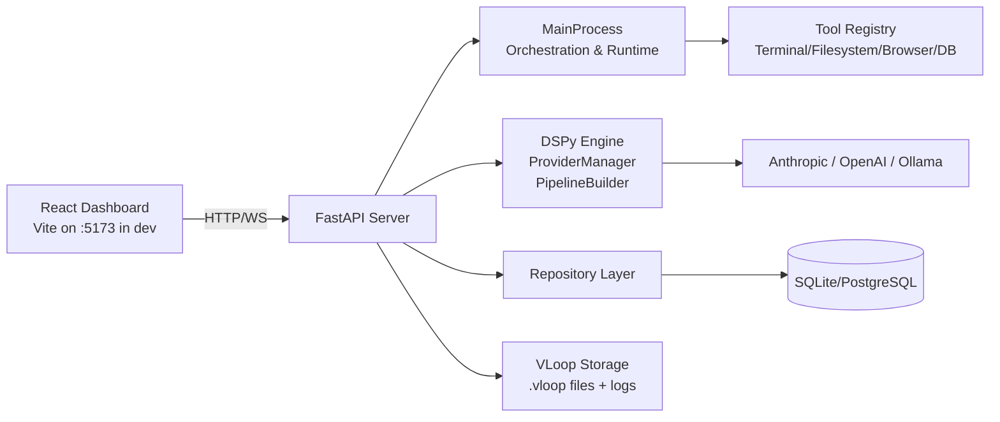

# Vloop Harness

Vloop Harness is a local-first AI engineering workbench that combines a Python orchestration backend with a React control-plane UI for building, running, and evaluating DSPy-based agents, components, and pipelines.

## Overview

Vloop Harness provides a FastAPI backend, a dynamic tool runtime (terminal, filesystem, browser, database), and a React dashboard for chat, component authoring, pipeline execution, view generation, and evaluation. The system is designed for local development with an option to use hosted LLM providers.

## Architecture



Key runtime roles:
- FastAPI app: HTTP + WebSocket API surface used by the React dashboard and external integrators.
- MainProcess: centralized orchestration for component/pipeline execution, tool invocation, and long-running runs.
- DSPy Engine: provider manager, pipeline builder, and execution runtime.
- Tool Registry: sandboxed tool adapters (filesystem, terminal, browser automation, DB) with policy/confirmation gating.
- VLoop Storage: local project storage, logs, and optional encryption.

## Quickstart

Prerequisites

```bash
python --version      # must be 3.11+
node --version        # must be >=18.18.0
npm --version
```

Getting started

```bash
git clone https://github.com/Psyborgs-git/Vloop-harness.git
cd Vloop-harness

# Python environment + backend dependencies
python -m venv .venv
source .venv/bin/activate
pip install -e .

# Frontend dependencies
cd react
npm install
cd ..

# Environment
cp .env.example .env
# Edit .env and set API keys if using hosted providers (Anthropic / OpenAI) or point OLLAMA_BASE_URL.

# Start backend + frontend
python -m harness.main services start all

# Open the app
# Visit http://localhost:8000/ui/root

# Stop services
python -m harness.main services stop all
```

## Tech stack

- Backend: Python 3.11+, FastAPI, Uvicorn
- Orchestration: MainProcess, DSPy engine
- Frontend: React + Vite (dev proxy or static mode)
- DB: SQLite (default) or PostgreSQL via VLOOP_DB_URL
- LLMs: Anthropic, OpenAI, Ollama (pluggable provider manager)

## Project structure

```
.
├── harness/                 # Python backend package
│   ├── core/                # MainProcess, lifecycle, permissions, orchestration
│   ├── data/                # SQLAlchemy models, DB init, repository layer
│   ├── engine/              # DSPy wiring, providers, pipeline builder
│   ├── server/              # FastAPI app factory, routes
│   ├── tools/               # Tool implementations + policy runtime
│   ├── vloop/               # Project storage, secrets, redaction helpers
│   ├── components/          # Example/legacy Python components
│   └── main.py              # CLI entrypoint (`harness`)
├── react/                   # React/Vite dashboard
├── docs/                    # Canonical project documentation
├── DOCS/                    # Legacy docs (historical/reference)
├── tests/                   # Python tests
└── pyproject.toml           # Python project metadata and tooling
```

## Environment variables (high level)

- HARNESS_HOST (default: localhost)
- HARNESS_PORT (default: 8000)
- HARNESS_DEBUG (dev proxy behavior for Vite)
- DSPY_LM_PROVIDER (anthropic | openai | ollama)
- DSPY_LM_MODEL (default model name used by provider)
- ANTHROPIC_API_KEY / OPENAI_API_KEY (encrypted when stored)
- OLLAMA_BASE_URL (local Ollama endpoint)
- VLOOP_DB_URL (optional; if empty, SQLite local DB is used)
- VLOOP_PROJECT_DIR (.vloop by default)

See .env.example for the full template and docs/SETUP.md for environment-specific setup details.

## CLI & scripts

Python (via pyproject/CLI):
- `harness run` — start orchestrator
- `harness services start [backend|frontend|all]` — start managed subprocesses
- `harness services stop [backend|frontend|all]`
- `harness services status`

Frontend (react/package.json):
- `npm run dev` — start Vite dev server
- `npm run build` — build production assets
- `npm run preview` — preview production build
- `npm run test:e2e` — Playwright E2E tests

## Testing

Python tests

```bash
pytest
```

Frontend type checks and e2e

```bash
cd react && npm run typecheck
cd react && npm run test:e2e
```

## Documentation

Full documentation lives under `docs/` and includes API reference, architecture notes, setup instructions, contributing guidelines, and troubleshooting. Start at `docs/README.md`.

## Contributing

See docs/CONTRIBUTING.md for contribution guidelines, code style, and testing expectations.
