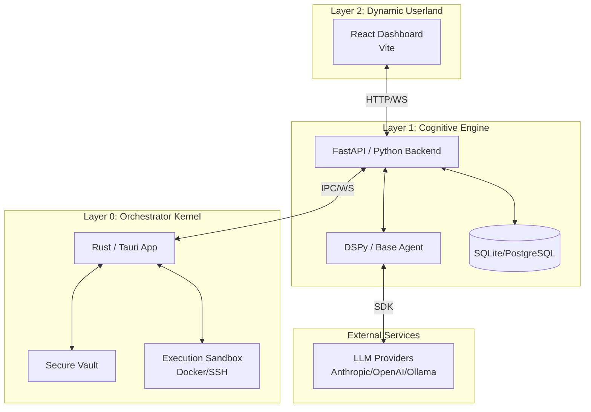

# Vloop Harness

Vloop Harness is a local-first AI engineering workbench designed with a strict three-layer architecture. It acts as an AI-driven operating system sandbox, combining a native Rust kernel, a Python cognitive engine, and a React userland for building, running, and evaluating DSPy-based agents and pipelines.

## Architecture

Vloop Harness is built on three distinct layers with strict IPC communication rules:

1. **Layer 0: Orchestrator Kernel (Rust/Tauri)**
   - The "Nervous System".
   - Handles secure boot, process lifecycle, health checks, ports, filesystem permissions, API vaults, and execution sandboxes.
   - Fully implements the execution transport layer natively (e.g., Docker via `bollard`, SSH via `ssh2`).
2. **Layer 1: Cognitive Engine (FastAPI/Python)**
   - The "Brain".
   - Powered by DSPy and LiteLLM.
   - The Base Agent generates configurations, handles auto-evaluation loops, and dynamically relays Human-in-the-Loop (HITL) requests.
   - Enforces a policy engine (via `policy.json`) and validates AST-based SQL queries using `sqlglot`.
3. **Layer 2: Dynamic Userland (React)**
   - The "Body".
   - A dynamic web layer rendering AI-generated code inside iframes and handling user interactions.

### Communication Flow

**Strict IPC Rule:** The Rust backend (Layer 0) **never** communicates directly with the React frontend (Layer 2).
- Rust ↔ Python: IPC/WebSockets.
- Python ↔ React: HTTP/WebSockets.



## Security & Sandboxing
- **Tool Gating:** A centralized `policy.json` dictates tool action boundaries (e.g., allowed origins, filesystem limits).
- **SQL Validation:** The Python backend parses all SQL operations via `sqlglot` to permit strictly allowed operations (`Select`, `Insert`, `Update`, `Delete`) and permanently block DDL (`Drop`, `Alter`, etc.).
- **Vault Management:** Sensitive keys and credentials are stored inside a Rust-managed Secure Vault and exposed to Python runtime strictly via IPC.

## Tech Stack
- **Layer 0:** Rust (Tauri, axum, tokio, bollard, ssh2)
- **Layer 1:** Python 3.11+, FastAPI, Uvicorn, DSPy, SQLAlchemy 2.0+ (async), `sqlglot`
- **Layer 2:** Node.js >=18, React, Vite, MUI
- **Data Persistence:** SQLite (default) / PostgreSQL (optional)

## Prerequisites
```bash
rustc --version       # must be installed
cargo --version       # must be installed
python --version      # must be 3.11+
node --version        # must be >=18.18.0
npm --version
uv --version          # uv package manager required
```

## Getting Started
```bash
git clone <repo-url>
cd Vloop-harness

# 1) Build the Rust core (Tauri App)
cd src-tauri
cargo build --release
cd ..

# 2) Python environment + backend dependencies
uv venv
source .venv/bin/activate
uv pip install -e .[dev]

# 3) Frontend dependencies
cd react
npm install
cd ..

# 4) Environment setup
cp .env.example .env
# Edit .env and set API keys and configuration

# 5) Run the application
# Use the tauri development CLI or run the built binary
cd src-tauri
cargo tauri dev
```

## Project Structure
```text
.
├── src-tauri/               # Layer 0: Rust Kernel (Tauri app, Orchestrator, Sandbox)
├── harness/                 # Layer 1: Python Backend (FastAPI, DSPy engine, Routing)
├── react/                   # Layer 2: React Frontend (Vite, Dynamic UI)
├── docs/                    # Architectural and project documentation
├── tests/                   # Python backend test suite
├── .env.example             # Environment variable template
└── pyproject.toml           # Python project metadata and dependencies
```

## Documentation
For a deep dive into the system design, please see our new documentation directory at `docs/`.
- [Architecture & Design](docs/ARCHITECTURE.md)
- [Implementation Plan](docs/IMPLEMENTATION_PLAN.md)

## Contributing
Please see standard contribution guidelines in the respective component folders. We follow a strict pull request workflow targeting the `main` branch.
