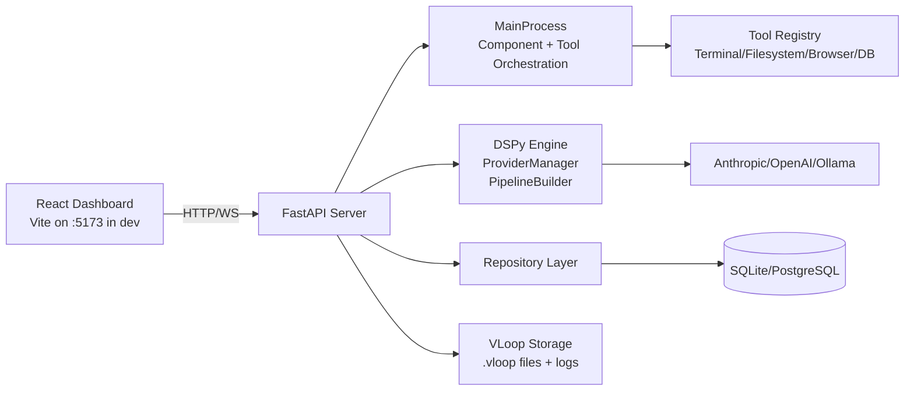

# Vloop Harness
Vloop Harness is a local-first AI engineering workbench that combines a Python orchestration backend with a React control-plane UI for building, running, and evaluating DSPy-based agents and pipelines.

## Overview
Vloop Harness provides a FastAPI backend, a dynamic tool runtime (terminal, filesystem, browser, database), and a React dashboard for chat, component authoring, pipeline execution, view generation, and agent run orchestration. It is designed for engineers iterating on AI components with auditable state and policy-constrained tool access. The backend persists metadata in SQLite by default (with optional PostgreSQL), including chat transcripts, provider configs, component definitions, pipeline specs, app manifests, tool traces, and agent run logs. Architecturally, the system separates runtime concerns into core process orchestration, API routes, AI engine modules, and persistence layers, while keeping UI concerns in a separate Vite/React project.

## Architecture


## Tech Stack
| Layer | Technology | Version | Purpose |
|---|---|---|---|
| Backend runtime | Python | >=3.11 | Core runtime for API, orchestration, tools |
| Backend framework | FastAPI | >=0.115.0 | HTTP + WebSocket API |
| ASGI server | Uvicorn | >=0.32.0 | FastAPI serving |
| CLI | Typer | >=0.15.0 | `harness` command and service control |
| AI orchestration | DSPy | >=2.5.0 | LLM module/pipeline execution |
| LLM providers | anthropic/openai SDKs | >=0.40.0 / >=1.57.0 | Hosted model access |
| Data access | SQLAlchemy asyncio | >=2.0.0 | ORM + async DB sessions |
| Default DB | SQLite + aiosqlite | >=0.20.0 | Local metadata persistence |
| Optional DB | PostgreSQL + asyncpg | >=0.30.0 | External production-style DB |
| Frontend runtime | Node.js + npm | >=18.18.0 | React/Vite toolchain |
| Frontend framework | React | ^18.3.1 | Root dashboard UI |
| Frontend build tool | Vite | ^6.0.3 | Dev server + bundling |
| UI component library | MUI | ^5.16.x | Dashboard components |
| E2E testing | Playwright | ^1.56.1 | Browser-level tests |
| Python testing | pytest/pytest-asyncio | >=8.3.0 / >=0.24.0 | Unit/integration tests |
| Linting/type checks | Ruff + mypy + TypeScript | >=0.8.0 / >=1.13.0 / ^5.6.3 | Static quality checks |

## Prerequisites
```bash
python --version      # must be 3.11+
node --version        # must be >=18.18.0
npm --version
```

## Getting Started
```bash
git clone <repo-url>
cd Vloop-harness

# 1) Python environment + backend dependencies
python -m venv .venv
source .venv/bin/activate
pip install -e .

# 2) Frontend dependencies
cd react
npm install
cd ..

# 3) Environment setup
cp .env.example .env
# Edit .env and set API keys if using hosted providers.

# 4) Start backend + frontend services
python -m harness.main services start all

# 5) Open app
# Visit http://localhost:8000/ui/root

# 6) Stop services when done
python -m harness.main services stop all
```

## Project Structure
```text
.
├── harness/                 # Python backend package
│   ├── core/                # MainProcess, lifecycle, permissions, state/log orchestration
│   ├── data/                # SQLAlchemy models, DB initialization, repository layer
│   ├── engine/              # DSPy engine, providers, pipeline builder, agent modules
│   ├── server/              # FastAPI app factory, routes, HTML injector
│   ├── tools/               # Tool implementations + policy/confirmation runtime
│   ├── vloop/               # Project storage + encryption + redaction helpers
│   ├── components/          # Example/legacy Python components
│   ├── main.py              # CLI entrypoint (`harness`)
│   └── settings.py          # Env-backed settings model
├── react/                   # React/Vite dashboard
│   ├── src/components/root/ # Main root dashboard panels
│   ├── src/harness/         # Frontend harness types/hooks/provider
│   └── tests/e2e/           # Playwright tests
├── tests/                   # Python backend test suite
├── docs/                    # Project documentation set
├── DOCS/                    # Legacy docs (historical/reference)
├── .env.example             # Environment variable template
└── pyproject.toml           # Python project metadata and tooling config
```

## Environment Variables
| Variable | Required | Default | Description |
|---|---|---|---|
| HARNESS_HOST | No | `localhost` | FastAPI host bind/address |
| HARNESS_PORT | No | `8000` | FastAPI port |
| HARNESS_DEBUG | No | `true` | `true`: proxy Vite dev server; `false`: serve `react/dist` |
| VITE_HOST | No | `localhost` | Vite host used by proxy/health checks |
| VITE_PORT | No | `5173` | Vite port |
| DSPY_LM_PROVIDER | No | `anthropic` | Active provider type (`anthropic` / `openai` / `ollama`) |
| DSPY_LM_MODEL | No | `claude-sonnet-4-6` | Default model name |
| ANTHROPIC_API_KEY | Yes* | none | **Secret**. Required when using Anthropic |
| OPENAI_API_KEY | Yes* | none | **Secret**. Required when using OpenAI |
| OLLAMA_BASE_URL | No | `http://localhost:11434` | Ollama endpoint |
| STATE_DB_PATH | No | `.harness/state.db` | Legacy harness state DB path |
| LOG_DIR | No | `.harness/logs` | Harness logs directory |
| VLOOP_DB_URL | No | empty -> SQLite fallback | Async SQLAlchemy DB URL override |
| VLOOP_PROJECT_DIR | No | empty -> CWD/.vloop | Override `.vloop` data directory |
| TOOLS_POLICY_PATH | No | `<workspace>/.vloop/policy.json` | Optional tool policy override |

\* Required only for corresponding provider.

## Available Scripts
### Python (`pyproject.toml` / CLI)
- `harness run`: start orchestrator; optional `--no-window` and `--frontend-mode dev|static`.
- `harness services start [backend|frontend|all]`: start managed subprocess services.
- `harness services stop [backend|frontend|all]`: stop services.
- `harness services restart [backend|frontend|all]`: restart services.
- `harness services status`: report PID + health for services.
- `harness internal backend-worker`: internal-only backend launch command.

### Frontend (`react/package.json`)
- `npm run dev`: start Vite dev server.
- `npm run build`: run TS check then build production assets.
- `npm run preview`: preview production build.
- `npm run typecheck`: TypeScript no-emit type check.
- `npm run test:e2e`: run headless Playwright suite.
- `npm run test:e2e:headed`: run headed Playwright suite.

## Testing
```bash
# Python tests
pytest

# Optional with coverage
pytest --cov=harness --cov-report=term-missing

# Frontend type safety
cd react && npm run typecheck

# Frontend e2e
cd react && npm run test:e2e
```
Python tests cover route behavior, permissions/policy, storage/repository behavior, and tool execution flows. E2E coverage exists for key root UI behavior via Playwright.

## Deployment
Current deployment is process-managed local service startup via the CLI service manager. `frontend_mode=static` enables production-style serving from `react/dist` directly behind FastAPI. CI/CD workflow files are not present in this repository, so deployment checks are currently expected to run locally (`pytest`, TypeScript checks, and optional Playwright e2e) before merge.

## Contributing
See [docs/CONTRIBUTING.md](docs/CONTRIBUTING.md).
