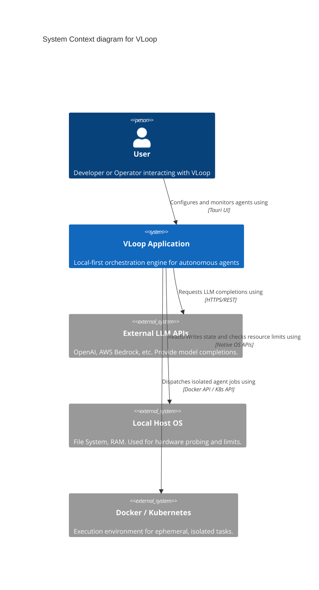
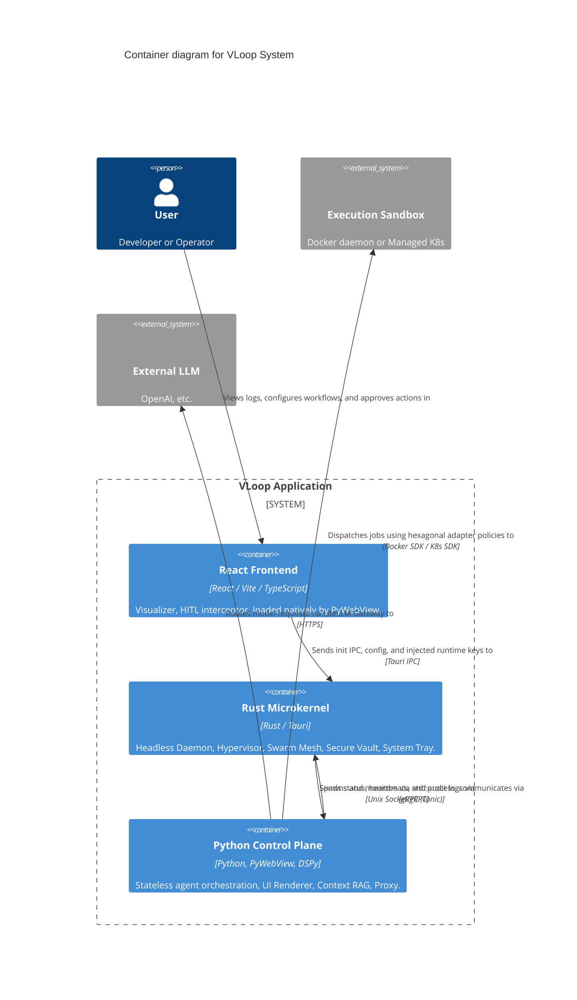
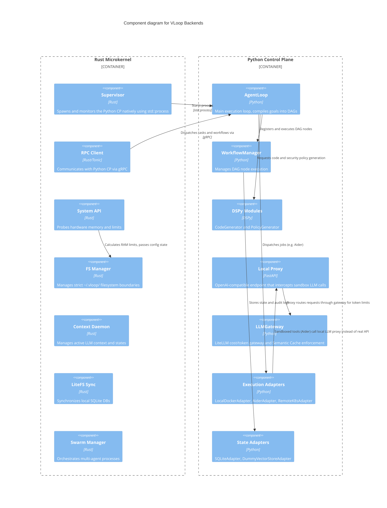
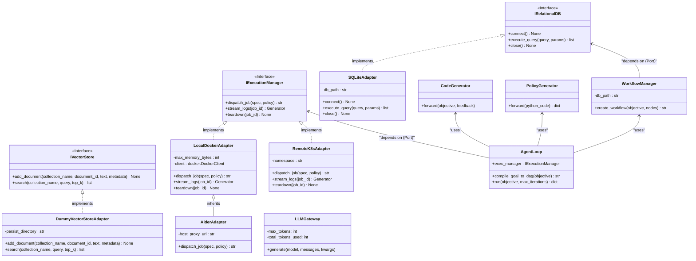

# VLoop: Comprehensive Software Architecture

**Version:** 1.0
**Target Platforms:** Windows, macOS, Linux
**Core Paradigm:** Hexagonal Architecture, Rust Microkernel, Isolated DSPy Execution Sandboxes.

This document describes the software architecture of VLoop using the **C4 Model** (Context, Container, Component, Code), leveraging Mermaid diagrams to visualize each level of the system. It strictly reflects the concrete classes, adapters, and modules currently implemented in the codebase.

---

## Level 1: System Context Diagram

The System Context diagram provides a high-level overview of how the VLoop application interacts with its external environment, including users, the local operating system, external LLM providers, and execution sandboxes.

---

## Level 2: Container Diagram

The Container diagram zooms into the VLoop Application to show its core deployable units. VLoop is separated into a frontend UI, a native Rust microkernel hypervisor, and an isolated Python Control Plane that relies on Hexagonal adapters.

### Documentation Links
- [Tauri UI](docs/container/Tauri-UI.md)
- [Rust Microkernel](docs/container/Rust-Microkernel.md)
- [Python Control Plane](docs/container/Python-Control-Plane.md)

---

## Level 3: Component Diagram

The Component diagram dives deeper into the Rust Microkernel and the Python Control Plane, accurately mapping the Rust modules (`supervisor`, `sys`, `rpc`, `litefs_sync`, etc.) and the Python modules (`LLMGateway`, `Proxy`, `AgentLoop`, and specific `Adapters`).

---

## Level 4: Code Diagram (Hexagonal Architecture)

The Code-level diagram highlights the true Hexagonal Architecture (Ports and Adapters) utilized by the Python Control Plane, including specialized adapters like `AiderAdapter` and `DummyVectorStoreAdapter`, and components like `LLMGateway`.

### Documentation Links

#### Ports (Interfaces)
- [IExecutionManager](docs/code/IExecutionManager.md)
- [IRelationalDB](docs/code/IRelationalDB.md)
- [IVectorStore](docs/code/IVectorStore.md)

#### Adapters
- [LocalDockerAdapter](docs/code/LocalDockerAdapter.md)
- [AiderAdapter](docs/code/AiderAdapter.md)
- [RemoteK8sAdapter](docs/code/RemoteK8sAdapter.md)
- [SQLiteAdapter](docs/code/SQLiteAdapter.md)
- [DummyVectorStoreAdapter](docs/code/DummyVectorStoreAdapter.md)

#### Core Logic
- [CodeGenerator](docs/code/CodeGenerator.md)
- [PolicyGenerator](docs/code/PolicyGenerator.md)

---

## Operational Workflow Highlights

1. **Boot**: The Tauri UI initiates the Rust microkernel. Rust determines hardware limits (`sys`), sets up `fs`, and spawns the Python Control Plane via `supervisor`. Inter-process communication leverages gRPC (`rpc`).
2. **Task Ingestion**: The CP takes a prompt, leverages DSPy + `LLMGateway` (LiteLLM) to compile it into executable code alongside a generated strict security policy via `PolicyGenerator`.
3. **Sandboxed Execution**: The CP routes the job via the `IExecutionManager` port to either local Docker (or a specialized `AiderAdapter`) or remote K8s. 
4. **Proxy & Limits**: Executing harnesses do not have direct access to external API keys. They point to the `FastAPI Proxy`, which intercepts the calls and routes them through the `LLMGateway` for strict token budget enforcement.
5. **Validation**: The job completes. If it fails, standard error output is captured and routed back to DSPy to refine the code until success or the loop threshold limit is met.
 routed back to DSPy to refine the code until success or the loop threshold limit is met.
b via the `IExecutionManager` port to either local Docker (or a specialized `AiderAdapter`) or remote K8s. 
4. **Proxy & Limits**: Executing harnesses do not have direct access to external API keys. They point to the `FastAPI Proxy`, which intercepts the calls and routes them through the `LLMGateway` for strict token budget enforcement.
5. **Validation**: The job completes. If it fails, standard error output is captured and routed back to DSPy to refine the code until success or the loop threshold limit is met.
