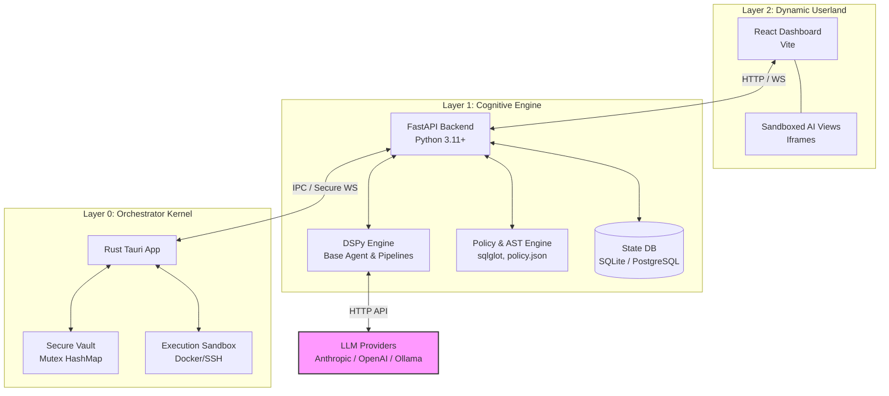

# System Architecture

## Executive Summary

Vloop Harness is a local-first AI engineering workbench designed to operate as a secure, three-tiered "AI Operating System" sandbox. It combines a native Rust kernel, a Python-powered cognitive engine, and a React dynamic userland.

This strict separation of concerns allows the AI Harness to safely execute generated code, query databases, run terminal commands, and navigate web pages while keeping the sensitive core (secrets, file system boundaries, and transport execution) isolated and protected.

## Macro-Architecture Diagram

The system operates across three distinct layers, enforcing a strict boundary constraint: **The Rust Kernel (Layer 0) never communicates directly with the React Frontend (Layer 2).** All communication from the frontend must be routed through the Python Engine (Layer 1).

## Design Philosophy

The architectural design of Vloop Harness is driven by three core philosophies: **Domain Separation, Secure Sandboxing, and Human-in-the-Loop Control.**

### 1. Strict Domain Separation
*   **Layer 0 (Rust/Tauri Native Hypervisor):** Rust provides speed, memory safety, and low-level system access. It acts purely as a native hypervisor and system manager. It is responsible for:
    *   **Process Management:** Spawning, tracking, and terminating isolated execution sandboxes (e.g., Docker, SSH) via `bollard` and `russh`.
    *   **Secure Vault:** Holding sensitive credentials securely in memory (`Mutex HashMap`).
    *   **Vault Variable Injection:** Safely injecting vault secrets as environment variables into managed processes at startup.
    *   **Transport Layer:** Handling gRPC over QUIC/UDP for low-latency streaming between layers.
    *   **Data Persistence:** Using SQLite exclusively for terminal logging and kernel-level state, offloading all application/AI configurations to the backend.
    *   **Network Fencing:** Enforcing strict network constraints (e.g., proxy/iptables) on sandboxes.
    *   **Failsafe UI:** Providing a native `egui` interface for emergency process management.
    The kernel has absolutely no AI awareness, does no context cleaning (which is strictly enforced at Layer 1), and offloads all business logic configurations to the backend.
*   **Layer 1 (Python/FastAPI):** Python is the ideal ecosystem for AI engineering, allowing deep integration with DSPy, LiteLLM, and AST-parsing tools like `sqlglot`. It handles the cognitive routing, pipeline generation, and tool decision-making, as well as enforcing AI context cleaning and maintaining application configurations.
*   **Layer 2 (React/Vite):** The React frontend is isolated from system internals. It dynamically renders AI-generated UI components inside secure iframes, preventing cross-site scripting (XSS) or main-thread blocking by faulty generated code.

### 2. Gated Security & Vaults
*   **AST-Based Gating:** Instead of blindly passing AI-generated SQL to a database, Layer 1 uses `sqlglot` to parse queries into an Abstract Syntax Tree (AST). It mathematically guarantees that DDL commands (`DROP`, `ALTER`) are blocked, and strictly routes read (`SELECT`) and write (`INSERT`, `UPDATE`) commands to their appropriate tool methods.
*   **Configurable Policy Engine:** A centralized `policy.json` dictates the exact limits of the agent. It enforces filesystem read/write boundaries, allowed terminal commands, and permissible browser origins.
*   **Secure Vault:** Sensitive information (API keys, database credentials) is never stored in Layer 1 or Layer 2 memory longer than necessary. Keys are held in a Rust-managed vault (`VAULT` mutex in `modules/vault.rs`) and are retrieved dynamically via IPC when needed.

### 3. Human-in-the-Loop (HITL) Execution
Vloop Harness treats AI agents as autonomous but untrusted.
Whenever an agent attempts a high-risk or destructive operation (like writing to the database or running an un-allowlisted terminal command), the tool registry halts the execution. It proxies a request to Layer 2 for user confirmation via WebSocket, waiting for the user to explicitly approve or deny the action before unlocking the execution sandbox in Layer 0.
