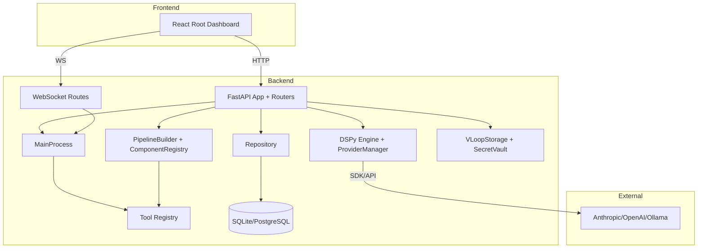

## System Overview
Vloop Harness is responsible for orchestrating AI-assisted engineering workflows: chat-driven generation, DSPy component/pipeline execution, tool-mediated actions (filesystem, terminal, browser, database), and persistence of operational artifacts. System boundaries include a local FastAPI server, a React dashboard, and optional remote model providers. It is **not** responsible for remote multi-tenant auth, production job scheduling, or cloud-native deployment automation.

## Architecture Pattern
The codebase follows a **layered modular monolith** pattern:
- **Interface layer**: FastAPI routes + WebSockets + React UI.
- **Application/orchestration layer**: `MainProcess`, `ServiceManager`, `AgentOrchestrator`, DSPy pipeline builder.
- **Domain/data layer**: SQLAlchemy ORM models + repository abstraction.
- **Infrastructure layer**: storage, encryption vault, tool adapters, provider SDK integrations.

This pattern fits the domain because workflows are tightly coupled (chat, tooling, DSPy, persistence), but still require strict subsystem boundaries to keep route handlers thin and maintain auditable state transitions.

## Component Diagram

## Directory Structure Deep Dive
- `harness/core/`: process lifecycle and runtime governance (`MainProcess`, permissions, state store, logger, component tree/process manager). Keep orchestration only; no route-specific parsing.
- `harness/server/`: FastAPI app factory and route modules. Keep HTTP contracts, validation, and serialization here; business persistence belongs in repository/services.
- `harness/engine/`: DSPy runtime wiring, providers, codegen/reasoning modules, and pipeline execution. Avoid direct HTTP coupling here.
- `harness/data/`: ORM schema + DB/session init + repository API. Route handlers should avoid raw SQLAlchemy access outside this layer.
- `harness/tools/`: sandboxed tool implementations with policy and confirmation gatekeeping.
- `harness/vloop/`: project-local filesystem structure, key management, and redaction utilities.
- `react/src/components/root/`: dashboard surface (panels for chat, eval, tools, settings, etc.).
- `tests/`: Python tests grouped by route/tool/core module behavior.
- `react/tests/e2e/`: browser-level test flows.

## Data Architecture
### Key entities
- `ChatSession`, `ChatMessage`: conversational records.
- `DSPyComponentDef`, `PipelineDef`: executable AI module and composition definitions.
- `ProviderConfigDB`: model provider settings with encrypted API keys.
- `GeneratedView`: AI-generated React view artifacts.
- `AgentRun`, `AgentRunStep`: durable run execution and audit trail.
- `AppManifest`: backend ↔ frontend app composition metadata.
- `ToolTrace`: tool invocation log.
- `ComponentVersion`, `EvalDataset`: versioning + evaluation support.

### Database choice
SQLite is default for local-first simplicity; PostgreSQL is supported via `VLOOP_DB_URL` for heavier workloads.

### Schema summary
ORM models are centralized in `harness/data/models.py`, with auto table creation at startup (`Base.metadata.create_all`) in `init_db()`.

### Caching strategy
No explicit distributed cache layer is implemented. In-memory caching exists implicitly in loaded component registries and active process state.

### Data flow
Input enters via HTTP/WS routes → validated by Pydantic models → orchestrator/repository operations execute → state is persisted in DB and/or `.vloop` storage → structured responses returned to UI.

## Request Lifecycle
Canonical flow (`POST /api/chat/sessions/{id}/messages`):
1. FastAPI route validates `SendMessageRequest`.
2. Repository persists user message.
3. Route gathers context (prior messages, component and pipeline inventory, tool catalog).
4. `MainProcess.ai` is invoked; response may include generated component code/pipeline JSON.
5. Optional side effects: compile/save generated component/pipeline and record transcript data.
6. Assistant message persisted.
7. Response serialized and returned to React panel.

## Key Design Decisions
| Decision | Options Considered | Choice | Rationale |
|---|---|---|---|
| API framework | Flask, FastAPI | FastAPI | Async support + Pydantic validation + WS support |
| Persistence abstraction | Direct ORM in routes, repository layer | Repository layer | Keeps routes thin and testable |
| Default DB | PostgreSQL only, SQLite default + optional PG | SQLite default | Local-first setup with PG escape hatch |
| LLM provider strategy | Single provider hardcoding, pluggable configs | Provider manager + DB configs | Runtime switching and secret management |
| Tool safety | Unrestricted tool calls, policy+confirmation gates | Policy + confirmation | Reduce accidental destructive operations |
| Frontend serving | Separate frontend server only, proxy/static dual mode | Dev proxy + static serving mode | Better dev UX and production-style fallback |

## Module Dependency Rules
- `server/routes` may depend on `data`, `engine`, `core`, `vloop`, but not vice-versa.
- `data` should not depend on `server` modules.
- `core` should remain framework-agnostic (no FastAPI imports).
- `tools` are invoked through registry APIs, not route-specific direct calls in arbitrary modules.
- React code should only consume backend contracts; no direct DB/engine access.

## External Integrations
- **Anthropic/OpenAI/Ollama**
  - Purpose: LLM completions for chat, codegen, view generation.
  - Call method: SDK clients (Anthropic/OpenAI) or HTTP endpoint (Ollama).
  - Auth: API keys (encrypted at rest); Ollama can be keyless local endpoint.
  - Failure handling: routes return error payloads/HTTP exceptions; provider test route reports detailed failures.
  - Location: `harness/engine/dspy_engine.py`, `harness/engine/providers.py`, `harness/server/routes/settings_routes.py`.
- **Filesystem/terminal/browser/database tools**
  - Purpose: agent actions against workspace/runtime.
  - Call method: internal tool registry execution APIs.
  - Auth: permission/policy enforcement with optional confirmation token flow.
  - Failure handling: translated to HTTP 400 or 202 (confirmation required).
  - Location: `harness/tools/*`, `harness/server/routes/tool_routes.py`.

## Scalability & Performance Considerations
- Async API + DB operations support concurrent requests, but process is still single-node local oriented.
- DSPy runs and some tool operations are synchronous/CPU- or IO-bound at execution points.
- No horizontal scaling coordinator is present; state is local DB/file oriented.
- Potential bottlenecks: long-running tool commands, model latency, and per-request compile/validation paths.

## Security Model
- Tool execution is policy-gated with deny/block lists and optional confirmation for high-risk actions.
- Provider API keys are encrypted through `SecretVault` before DB persistence.
- Pydantic request models enforce input shapes at API boundary.
- Attack surface includes command execution endpoints, filesystem writes, and browser automation; mitigations rely on policy engine and explicit confirmation flow.

## Known Technical Debt
- No CI pipeline files are committed, so quality gates are currently manual/local (pytest, type checks, and e2e as needed).
- API versioning policy is implicit rather than explicit in routes.
- AuthN/AuthZ for multi-user scenarios is not implemented (local trusted user model).
- Existing `DOCS/` and new `docs/` can drift without governance.
- Some runtime behavior still references “legacy component” paths while newer app-manifest/agent flows coexist.
