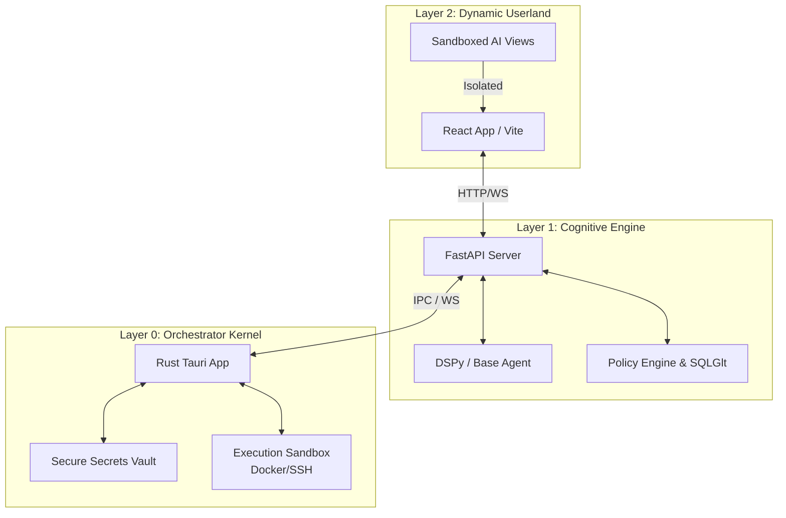

# Vloop Harness Architecture

Vloop Harness is an AI-driven operating system sandbox. It orchestrates AI-assisted workflows using a strict layered architecture pattern. The system is designed around a native Rust orchestrator, a Python cognitive engine, and a React dynamic userland.

This document outlines the architectural choices, system boundaries, and security patterns.

## System Overview

The core philosophy of Vloop Harness is **strict domain separation and secure execution.** The system is divided into three major components, or "Layers", each responsible for a distinct set of operations.

### 1. Layer 0: Orchestrator Kernel (Rust / Tauri)
The **Rust Kernel** acts as the system's "nervous system."
- **Core Responsibilities**: Secure boot lifecycle, health checks, port allocation, native UI rendering (Tauri), and strict management of the secure vault.
- **Native Sandbox execution**: Implements transport layers natively using crates like `bollard` for Docker daemon management and `ssh2` for remote connections.
- **Vault**: Sensitive keys and database credentials are held in a secure Rust-managed vault and are requested dynamically by the Python layer via IPC.

### 2. Layer 1: Cognitive Engine (Python / FastAPI)
The **Cognitive Engine** is the system's "brain."
- **Core Responsibilities**: Hosts the AI routing logic (DSPy/LiteLLM), orchestrates component logic, builds and evaluates AI pipelines, and processes interactions from the user interface.
- **AST-Based Gating**: Employs `sqlglot` for parsing and validating all AI-generated SQL queries before execution. It dynamically strictly permits reads/writes (`Select`, `Insert`, `Update`, `Delete`) and permanently blocks schema alterations (`Drop`, `Alter`, `Truncate`).
- **Policy Enforcement**: Enforces boundary limits using a `policy.json` (e.g., workspace limits for the Filesystem Tool, allowed origins for the Browser tool).

### 3. Layer 2: Dynamic Userland (React / Vite)
The **Dynamic Userland** is the system's "body" and sensory input.
- **Core Responsibilities**: Renders the frontend interface, provides chat components, visualizes tool traces and pipeline executions.
- **Dynamic Rendering**: Loads AI-generated code securely within sandboxed iframes/webviews, allowing real-time preview of generated views without compromising the main application DOM.

---

## The Strict IPC Rule

A fundamental architectural rule of Vloop Harness is its restricted communication flow:

**The Rust Kernel (Layer 0) MUST NEVER communicate directly with the React Frontend (Layer 2).**

All communication is strictly hierarchical and proxied:
1. React (Layer 2) talks to Python (Layer 1) via HTTP / WebSockets.
2. Python (Layer 1) talks to Rust (Layer 0) via IPC / Secure WebSockets.

### Communication Flow Diagram

---

## Security & Human-In-The-Loop (HITL)

Security is paramount when running AI agents that can generate code, run commands, and execute database queries.

### Human-In-The-Loop Workflow
Intrusive operations require explicit user approval. The flow follows the strict IPC rule:
1. Python attempts a high-risk operation (e.g., terminal command, DB write).
2. Python requests permission from the Rust Kernel via IPC.
3. If Rust determines HITL is required, it denies the request and signals Python.
4. Python relays the permission request to React via WebSockets.
5. The User approves/rejects via the React UI.
6. React notifies Python; Python notifies Rust.
7. Rust unlocks the operation in the Sandbox.

### AST-based Database Protection
The Python backend leverages the `sqlglot` library to perform Abstract Syntax Tree (AST) parsing on all generated SQL queries.
- It accurately detects the target dialect (SQLite/PostgreSQL).
- It categorizes the operation. Read-only operations (`Select`) are routed to read-only tool methods. Write operations (`Insert`, `Update`, `Delete`) are routed to write tool methods (often requiring HITL).
- DDL operations (`Drop`, `Alter`, `Truncate`) are permanently blocked by the engine before reaching the database execution layer.

### Configurable Gating (`policy.json`)
The `policy.json` configures the boundaries of the execution environment. This includes:
- Defining exactly which folders the FilesystemTool is allowed to read from or write to.
- Defining exactly which URLs the BrowserTool is allowed to navigate to.
- Allowlisting or denylisting specific terminal commands for the TerminalTool.

## Data Persistence
Vloop Harness persists state, logs, and configuration via asynchronous SQLAlchemy (using `asyncpg` for PostgreSQL and `aiosqlite` for local SQLite). SQLite is the default storage mechanism to maintain the "local-first" philosophy, but production deployments can seamlessly swap to PostgreSQL.
