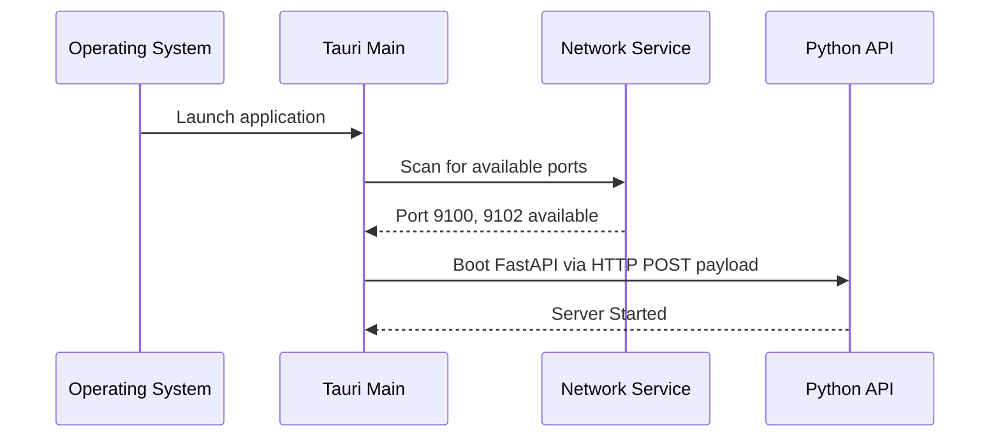
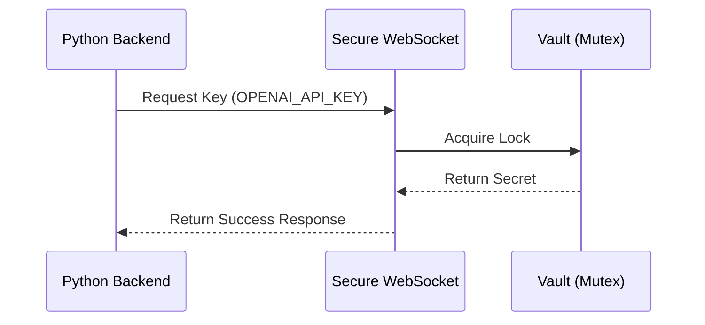
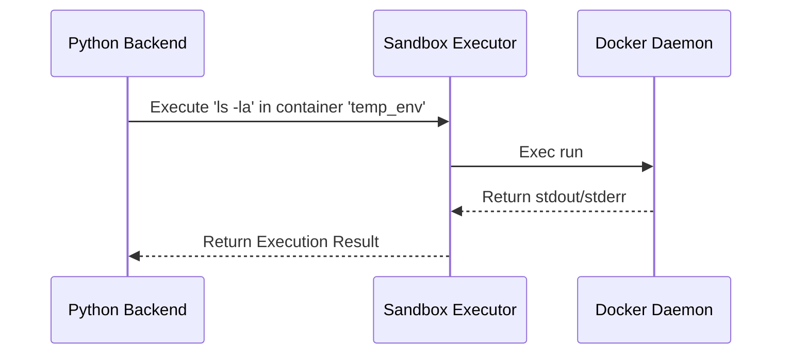
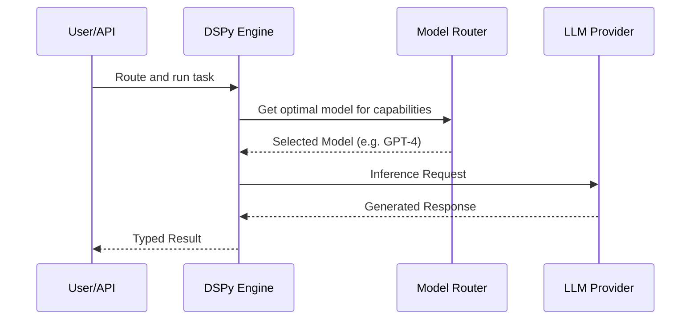
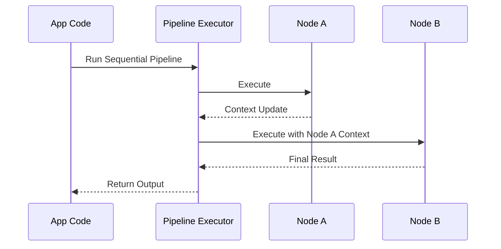
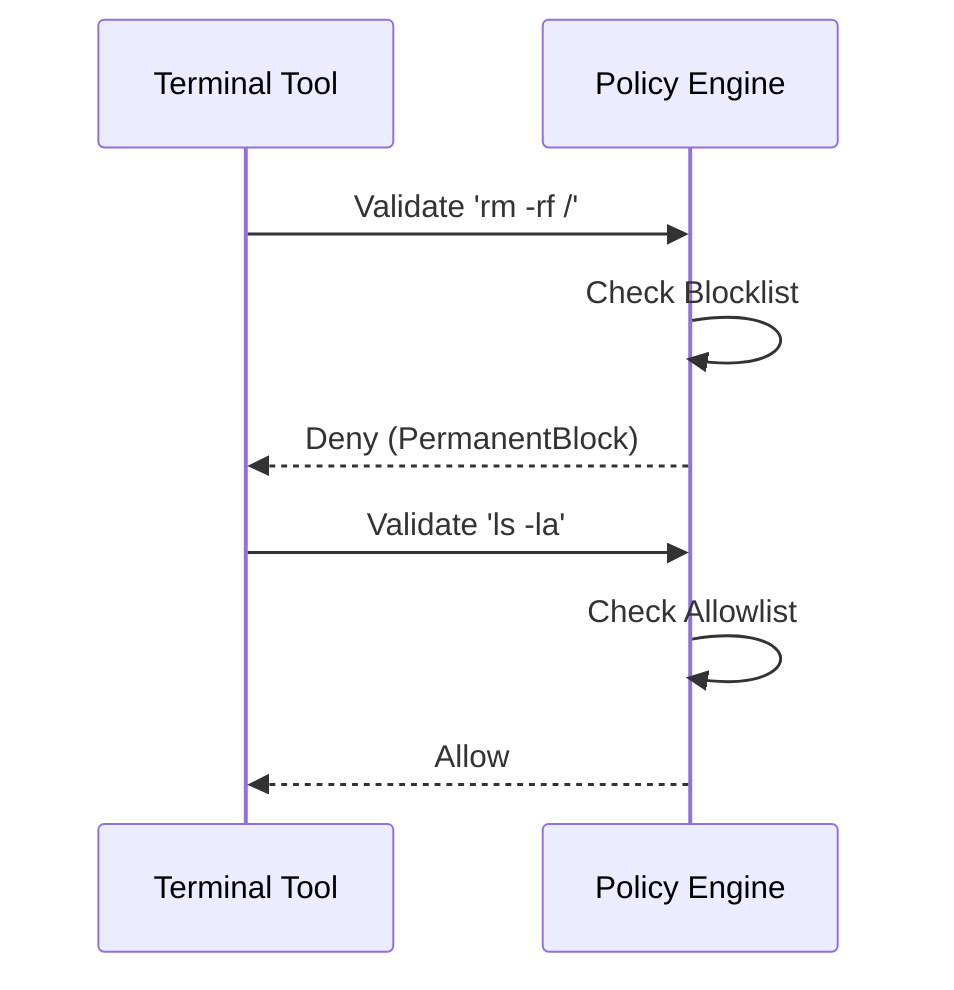
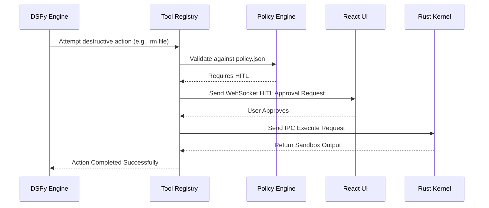
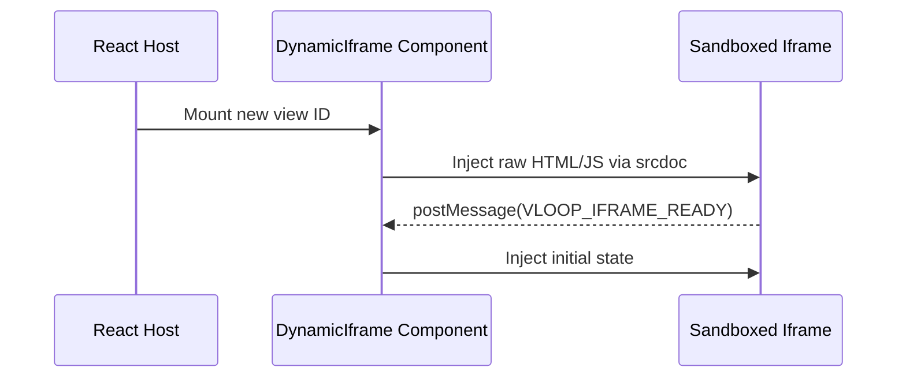
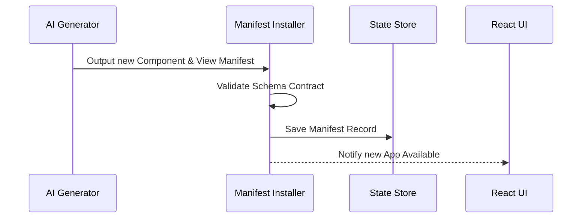

# Component Deep-Dive Guide

This document details the primary components of the Vloop Harness, broken down by their architectural layers.

## Layer 0: Orchestrator Kernel (Rust / Tauri)

### `Tauri App & IPC Router`
*   **Purpose:** The main executable and system entry point. It handles secure boot, application lifecycle, and routes IPC requests from Layer 1.
*   **Dependencies:** Tauri core libraries, Tokio async runtime.
*   **Internal Flow:**

*   **Edge Cases & Error Handling:** Port collisions during boot trigger a fallback UI. Unrecognized IPC payloads are rejected and logged.

### `Secure Vault`
*   **Purpose:** Stores sensitive credentials in memory securely so they do not live in Python or React state.
*   **Dependencies:** `std::sync::Mutex`, `HashMap`.
*   **Internal Flow:**

*   **Edge Cases & Error Handling:** If a requested key is not found, it safely returns an explicit Error to the Python caller instead of crashing.

### `Sandbox Executor`
*   **Purpose:** The native execution layer for terminal and file operations.
*   **Dependencies:** `bollard` (Docker daemon interaction), `ssh2` (Remote environments).
*   **Internal Flow:**

*   **Edge Cases & Error Handling:** Container crashes or SSH timeouts bubble up to Python with descriptive tracebacks for the AI to reason about.

## Layer 1: Cognitive Engine (Python / FastAPI)

### `DSPyEngine`
*   **Purpose:** The central AI brain. It wraps the DSPy language model configuration, offloads sync calls to thread pools to avoid blocking the FastAPI event loop, and handles model fallback routing.
*   **Dependencies:** `dspy`, `harness.engine.model_router`, `harness.engine.dynamic_config`.
*   **Internal Flow:**

*   **Edge Cases & Error Handling:** API rate limits or provider outages trigger the `ModelRouter` to automatically walk the fallback chain (e.g., Anthropic -> OpenAI -> local Ollama).

### `Pipeline Builder & Executor`
*   **Purpose:** Constructs Directed Acyclic Graphs (DAGs) of AI tasks. Supports sequential loops, conditional branches, and parallel map-reduce operations.
*   **Dependencies:** `harness.engine.pipelines.base`.
*   **Internal Flow:**

*   **Edge Cases & Error Handling:** Failure in a parallel map branch does not inherently crash the pipeline unless strict reduction is required.

### `Policy Engine`
*   **Purpose:** The security gatekeeper for tool calls. It evaluates commands against a permanent blocklist, a configurable denylist, and a directory-specific allowlist.
*   **Dependencies:** `harness.tools.policy`.
*   **Internal Flow:**

*   **Edge Cases & Error Handling:** Commands hitting the blocklist immediately fail with an `AccessDenied` exception. Ambiguous commands trigger Human-in-the-Loop (HITL) approval.

### `Database Tool & AST Parser`
*   **Purpose:** Safely executes database queries generated by the AI.
*   **Dependencies:** `sqlglot` (for AST parsing), SQLAlchemy 2.0 (asyncio).
*   **Internal Flow:**
```mermaid
sequenceDiagram
    participant AI as AI Agent
    participant DBTool as DB Tool
    participant AST as sqlglot Parser
    participant DB as SQLAlchemy

    AI->>DBTool: Execute 'DROP TABLE users;'
    DBTool->>AST: Parse Query
    AST-->>DBTool: Action Type: DDL
    DBTool-->>AI: Error (Operation Not Permitted)
```
*   **Edge Cases & Error Handling:** AST parsing strictly rejects DDL (`DROP`, `ALTER`). Parsing errors return a syntax error back to the AI for self-correction.

#### Common Flow: Tool Execution & HITL Flow


## Layer 2: Dynamic Userland (React)

### `WorkspaceArea & Dynamic Iframes`
*   **Purpose:** Renders AI-generated React/HTML views in isolation to prevent Main DOM pollution.
*   **Dependencies:** Vite, React `iframe`.
*   **Internal Flow:**

*   **Edge Cases & Error Handling:** Infinite loops in generated code only crash the iframe, not the main application. Error boundaries catch standard React rendering errors.

### `App Manifest Installer`
*   **Purpose:** Links backend Python components/pipelines to generated frontend views.
*   **Dependencies:** `harness/data/models.py` (AppManifest schema).
*   **Internal Flow:**

*   **Edge Cases & Error Handling:** Schema validation mismatches between the generated backend payload and the frontend expectation highlight the specific missing keys to the user.