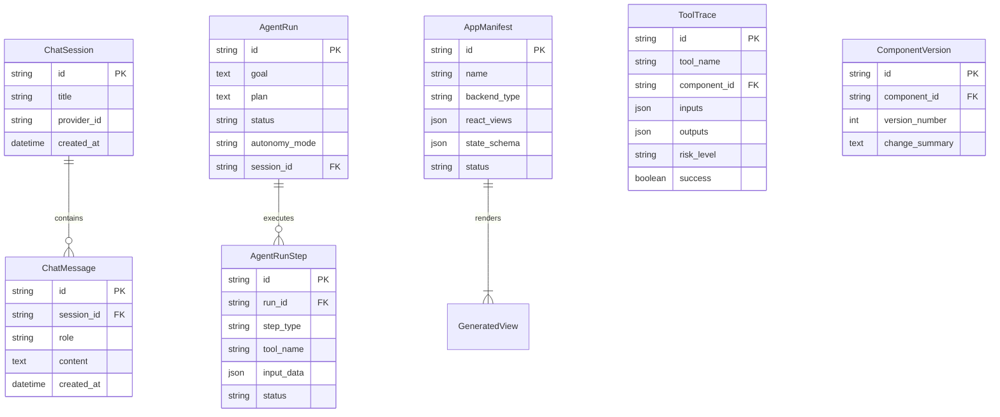

# Data Flow and State Management

This document details how data is persisted, cached, and managed across the Vloop Harness lifecycle. The backend leverages SQLAlchemy 2.0+ with `asyncio` (`asyncpg` for PostgreSQL or `aiosqlite` for local SQLite) to manage state.

## Entity Relationship Diagram

The following diagram illustrates the primary data models that drive the Vloop Harness state.

## Lifecycle of Core Entities

### 1. Agent Runs
The `AgentRun` model is the centerpiece of the AI execution lifecycle.
*   **Creation:** An agent run is initialized (status: `pending`) when a user requests a complex task via the chat interface or an API trigger.
*   **Execution:** As the DSPy agent plans and executes, `AgentRunStep` records are appended. This provides a strict, append-only audit log of what the AI is thinking, what tools it is calling, and what data it is receiving. The run status changes to `running`.
*   **Completion/Failure:** Upon successful conclusion, the status is marked `completed` and the final JSON structure is saved to the `result` field. If an unrecoverable error occurs, the status becomes `failed` with the traceback saved in the `error` field.

### 2. Tool Traces
For security and auditing, every execution of a system tool (filesystem, database, terminal, browser) is recorded in the `ToolTrace` table.
*   Secrets are redacted before storage.
*   Outputs are truncated at 8KiB to prevent database bloat.
*   If the tool required Human-in-the-Loop (HITL) authorization, the `confirmation_token` is logged to prove the user approved the risk level (`safe`, `caution`, `destructive`).

### 3. App Manifests
`AppManifest` records tie the Cognitive Engine (Layer 1) to the Dynamic Userland (Layer 2).
*   When the AI generates a new pipeline or component, it creates an `AppManifest` linking the backend logic (`backend_id`) to the generated React views (`react_views`).
*   The `state_schema` enforces the expected JSON data contract between the frontend React code and the backend Python code.

## Concurrency and State

*   **Async Operations:** All database calls utilize `sqlalchemy[asyncio]`. This prevents heavy AI processing or slow SQLite writes from blocking the FastAPI event loop.
*   **Atomic Operations:** Critical writes, such as appending an `AgentRunStep` during an active run, are handled transactionally to ensure the audit log remains consistent even if the python process crashes.
*   **Vector Store:** Unstructured data, embeddings, and RAG (Retrieval-Augmented Generation) documents are stored in a separate backend utilizing `sqlite-vec`. This runs in parallel to the relational state DB.