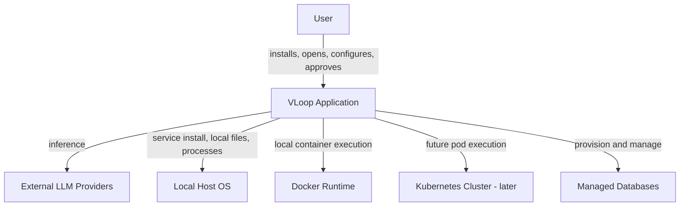
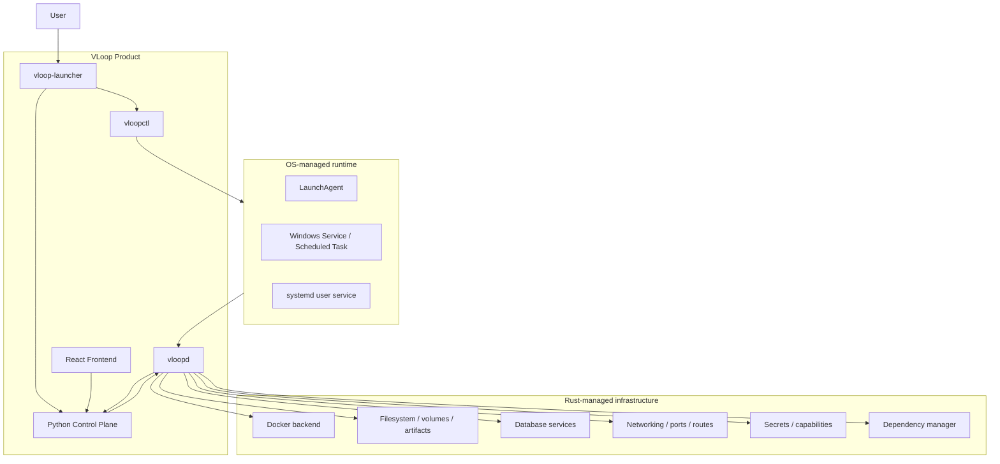
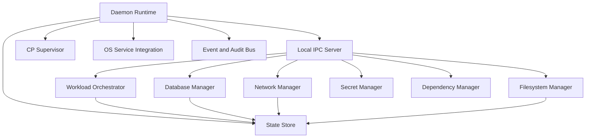
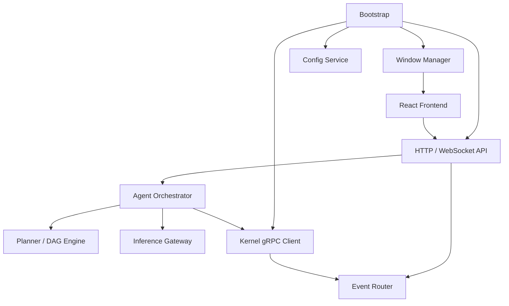

# VLoop Architecture Overview

This file is the canonical top-level blueprint for VLoop. It defines the target architecture, the major system boundaries, the build sequence, and the documentation map for every primary subsystem.

VLoop is a cross-platform, local-first AI orchestration platform built around two long-running authorities:

- **`vloopd`** — the Rust infrastructure daemon and resource authority.
- **Python Control Plane** — the cognitive authority, UI/window owner, and workflow engine.

Everything else exists to support that split.

---

## 1. System intent

VLoop should let a mostly non-technical user install a desktop-class AI automation system that can:

- run and supervise AI agent workflows;
- provision and manage local infrastructure safely;
- expose user-friendly windows and controls without terminal work;
- run generated code only inside controlled sandboxes;
- manage local and future distributed resources with clear ownership;
- keep secrets out of untrusted runtimes;
- behave consistently on macOS, Windows, and Linux.

---

## 2. Canonical documentation map

| Document | Scope |
|---|---|
| `docs/fix-plan.md` | Top-level architecture overview and blueprint index. |
| `docs/vloopd.md` | Rust kernel daemon specification. |
| `docs/vloopctl.md` | CLI/service control utility specification. |
| `docs/vloop-launcher.md` | User-facing launcher specification. |
| `docs/control-plane.md` | Python Control Plane specification. |
| `docs/frontend.md` | React frontend specification. |
| `docs/kernel-ipc.md` | Local IPC transport, registration, and security model. |
| `docs/proto-contract.md` | Canonical gRPC/proto contract blueprint. |
| `docs/workload-orchestrator.md` | Workload lifecycle, reconciliation, and execution model. |
| `docs/docker-backend.md` | Default local runtime backend specification. |
| `docs/filesystem-manager.md` | Workspaces, volumes, artifacts, quotas, and file-policy model. |
| `docs/database-manager.md` | SQLite/Postgres/Redis/vector-store lifecycle and capability model. |
| `docs/network-manager.md` | Ports, service routing, local networking, and future distributed networking. |
| `docs/secret-manager.md` | Secret storage, grants, injection, and audit model. |
| `docs/dependency-manager.md` | Runtime dependency detection, install strategy, doctor checks, and config injection. |
| `docs/packaging.md` | OS-native packaging, installers, services, and release artifacts. |
| `docs/security-model.md` | Threat model, trust boundaries, and security controls. |
| `docs/build-roadmap.md` | Greenfield build stages, milestones, and validation gates. |
| `docs/kubernetes-backend.md` | Post-local orchestration Kubernetes design. |
| `docs/distributed-swarm.md` | Future multi-node swarm design. |

---

## 3. Foundational architecture decisions

| Area | Decision |
|---|---|
| Infrastructure authority | Rust owns infrastructure, resources, services, filesystems, networking, secrets, databases, and supervision. |
| Cognitive authority | Python owns orchestration, agents, inference, configuration UX, windows, and user interactions. |
| Local runtime | Docker is the default local runtime on all supported OSes, with special importance on macOS/Windows. |
| OS integration | The app is delivered through native installers plus OS-native service management. |
| Local IPC | Rust and Python communicate over secure local IPC: Unix domain sockets on macOS/Linux and named pipes on Windows. |
| Secret flow | Secrets are granted and injected by capability; raw secret values should not be exposed to Python by default. |
| GUI ownership | The Python Control Plane owns windows and the frontend runtime. |
| Frontend boundary | React speaks to the Python Control Plane over HTTP/WebSocket APIs only. |
| Packaging | VLoop ships `vloopd`, `vloopctl`, `vloop-launcher`, the Python CP bundle/runtime, and the React static UI bundle. |
| Distributed future | Kubernetes and multi-node swarm are built after the single-node local system is production-grade. |

---

## 4. C4 Level 1 — System context



VLoop is a local application with external AI dependencies and local/managed execution resources. The user should experience it as a desktop product, but operationally it is a service-oriented local platform.

---

## 5. C4 Level 2 — Container view



### Container responsibilities

| Container | Role |
|---|---|
| `vloopd` | Long-running Rust daemon. Primary infrastructure runtime. |
| `vloopctl` | Operational control surface for users, installers, and support tooling. |
| `vloop-launcher` | End-user shortcut target that ensures the system is running and opens the UI. |
| Python Control Plane | Orchestrator, UI bridge, workflow engine, and inference gateway host. |
| React Frontend | User-facing application shell served by the CP. |

---

## 6. C4 Level 3 — Component view

### Rust kernel side



### Python Control Plane side



---

## 7. C4 Level 4 — Target repository shape

```text
Vloop-harness/
├── README.md
├── docs/
├── kernel/
│   ├── Cargo.toml
│   ├── build.rs
│   └── src/
│       ├── bin/
│       │   ├── vloopd.rs
│       │   ├── vloopctl.rs
│       │   └── vloop-launcher.rs
│       ├── daemon.rs
│       ├── ipc/
│       ├── orchestrator/
│       ├── service/
│       └── lib.rs
├── control-plane/
│   ├── main.py
│   ├── cp/
│   ├── core/
│   └── adapters/
├── proto/
│   ├── kernel.proto
│   └── control_plane.proto
├── src/
│   ├── index.html
│   ├── package.json
│   ├── vite.config.ts
│   └── src/
│       ├── App.tsx
│       ├── main.tsx
│       └── lib/
└── packaging/
    ├── macos/
    ├── windows/
    └── linux/
```

---

## 8. End-to-end runtime model

### 8.1 Install and first launch

1. Native installer places binaries, Python runtime assets, and UI assets.
2. Installer registers the OS-native service/agent/task for `vloopd`.
3. User opens VLoop using a normal launcher shortcut.
4. `vloop-launcher` ensures `vloopd` is running.
5. `vloopd` verifies dependencies and starts the Python CP.
6. Python CP registers with the kernel over local IPC.
7. CP opens or focuses the main window and serves the UI.

### 8.2 Workflow execution

1. User submits a workflow request in the frontend.
2. Frontend sends it to the Python CP over HTTP/WebSocket.
3. CP plans the workflow and requests resources from the kernel.
4. Kernel provisions workspaces, secrets, networking, databases, and workloads.
5. Workloads run under Rust supervision.
6. Kernel streams status/logs/events to the CP.
7. CP turns those into workflow state and UI updates.
8. Kernel tears down ephemeral resources and preserves requested artifacts.

### 8.3 Secret-aware inference

1. A workflow or model session needs a credential.
2. CP requests a grant, not the raw secret.
3. Kernel validates policy and issues a capability.
4. Kernel injects the secret into the workload or model session path.
5. Audit records capture the grant and use of the capability.

---

## 9. Ground-up build sequence

The build order is intentionally layered:

1. **Kernel shell** — `vloopd`, `vloopctl`, `vloop-launcher`, OS service integration, local IPC server.
2. **Control Plane shell** — CP bootstrap, health endpoint, window manager, kernel registration.
3. **Frontend shell** — React app connected to CP health + status endpoints.
4. **Workload infrastructure** — workload orchestration and Docker backend.
5. **Kernel managers** — filesystem, database, network, secrets, dependency manager.
6. **Full workflow engine** — planner, agents, inference gateway, event routing.
7. **Packaging** — macOS, Windows, and Linux release artifacts.
8. **Expansion layers** — Kubernetes backend, then distributed swarm.

The detailed stage gates live in `docs/build-roadmap.md`.

---

## 10. Definition of completion

The system is considered complete when:

- a non-technical user can install it on macOS, Windows, or Linux without a terminal-first workflow;
- `vloopd` runs as the stable infrastructure authority;
- Python CP owns the windows and workflow UX;
- all code execution happens in Rust-managed sandboxes;
- secrets are injected by capability rather than copied into untrusted runtimes;
- databases, filesystems, networks, and dependencies are managed by Rust;
- the UI is driven by CP HTTP/WebSocket APIs only;
- packaging, service management, logging, health, and recovery are production-grade.

---

## 11. How to use this blueprint

- Start with `docs/build-roadmap.md` for the construction order.
- Use `docs/vloopd.md`, `docs/control-plane.md`, and `docs/kernel-ipc.md` as the core implementation trio.
- Use the subsystem docs as canonical contracts when adding code under `kernel/`, `control-plane/`, `proto/`, `src/`, and `packaging/`.
- Update this overview only when a system-wide architectural decision changes.
