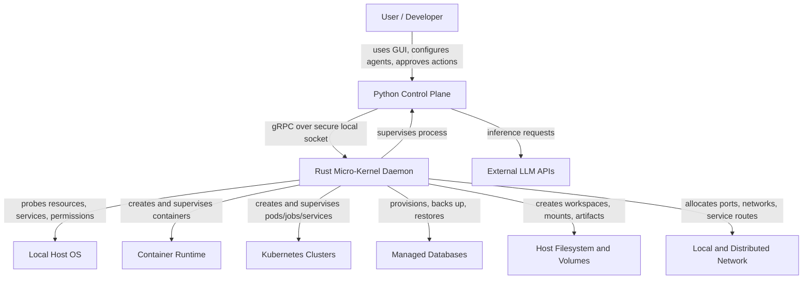
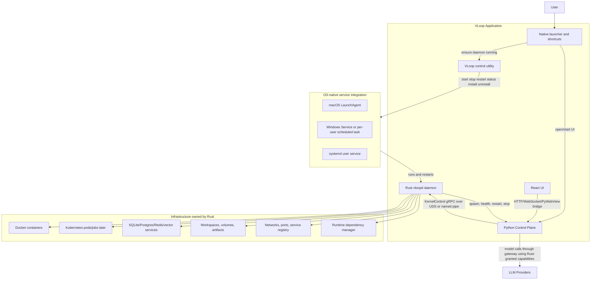
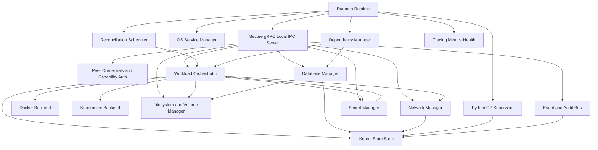
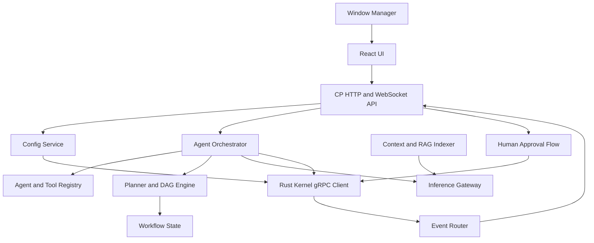
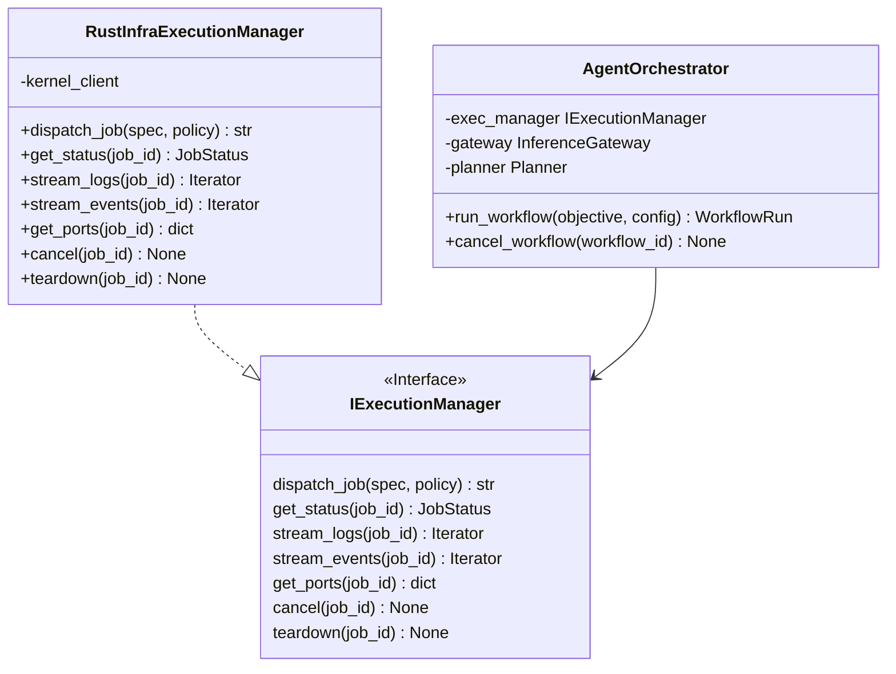

# VLoop Fix Plan: Rust Micro-Kernel as Infrastructure Orchestrator, Python Control Plane as Brain/UI

**Date:** 2026-06-18  
**Basis:** Static analysis of the current implementation. Existing docs are treated as non-authoritative because they diverge significantly from code.  
**Primary target:** Rust becomes the daemonized infrastructure orchestrator and Python becomes the AI/user-facing control plane.

---

## 1. Executive summary

The current repository has the shape of the desired architecture, but the authority boundary is inverted or incomplete in several critical places:

- Rust currently acts mostly as a **Tauri tray bootstrapper + Python supervisor + gRPC proxy**.
- Rust infrastructure APIs in `src-tauri/src/infra.rs` are **mocked**.
- Python currently performs real Docker/Kubernetes execution directly via `control-plane/adapters/docker_exec.py` and `control-plane/adapters/k8s_exec.py`.
- gRPC over Unix domain socket exists for **Rust → Python `SystemControl`**, but Python does not call Rust infrastructure over secure local IPC.
- `src-tauri/src/swarm.rs` exposes both `SystemControl` proxying and `InfrastructureControl` on unauthenticated `0.0.0.0:50052`.
- Python owns a PyWebView/FastAPI UI path, while the React frontend still uses Tauri `invoke()` APIs that are not registered in Rust and will not work when served by PyWebView.
- The docs overstate implemented capabilities: real LiteFS, secure vaulting, strict sandbox isolation, HITL, audit streaming, Rust-owned infrastructure, dynamic DSPy policies, and bidirectional secure IPC are not actually complete.

The fix is not just a documentation update. The repo needs a boundary migration:

```text
Python Control Plane owns: agents, orchestration, inference, config UX, GUI/windows, user interactions.
Rust Micro-Kernel owns: daemon lifecycle, infrastructure, containers/pods, DB lifecycle, filesystem/volumes, networking, secrets, resource limits, Python supervision.
```

---

## 2. Resolved architecture decisions

The open questions have been answered and are now target requirements for the plan.

| Decision | Final direction | Implementation impact |
|---|---|---|
| Local container backend | Use Docker as the default backend, especially on macOS and Windows where Podman/containerd may not be available. Keep the Rust runtime abstraction open for Podman/containerd later. | Rust implements Docker first. Podman/containerd are not first-milestone blockers. |
| Tauri | Remove Tauri from the target architecture. It was originally useful for cross-platform packaging, but the target is a Rust daemon plus Python-owned GUI. | Migrate Rust out of the Tauri app shape into standalone binaries and OS-native installers/service controls. |
| Packaging for non-technical users | Ship OS-native installers that install `vloopd`, service definitions, a `vloopctl` control binary, and a simple launcher/shortcut that opens the Python-owned UI. | Users should get start/quit/restart/status behavior through LaunchAgent/systemd/Windows Service or per-user equivalents, not by running terminal commands. |
| Databases/dependencies | Rust kernel manages all supported infrastructure dependencies: SQLite, Postgres, Redis, vector stores, local runtime dependencies, credentials, volumes, lifecycle, and dynamic config injection into Python CP. | Add Rust dependency/resource manager and config injection APIs. Python receives DSNs/capabilities/config, not direct ownership. |
| Distributed/swarm orchestration | Required eventually, but after local orchestration is solid. Keep remote swarm as TODO mocks/stubs for now. | Disable public remote APIs by default. Keep interfaces extensible, but do not build full distributed execution in the first production milestone. |
| Secrets | Rust only injects secrets into workloads and LLM calls by capability. Python should not receive raw secret values by default. | Replace raw `GetVaultSecret` model with grants, handles, injection, and audit events. |
| Windows IPC | Implement secure Windows IPC now, not later. Unix/macOS/Linux use Unix domain sockets; Windows uses named pipes or equivalent secure local transport. | Remove production loopback TCP fallback for Windows. Add tests for all OS transport paths. |

No major product-architecture questions remain open. The remaining decisions are implementation details: exact installer tooling, Docker client crate, DB provisioning order, and how much of the old `src-tauri` tree is migrated versus replaced.

---

## 3. Code-first current-state findings

### 3.1 Rust side today

| File | Current implementation reality | Gap vs target |
|---|---|---|
| `src-tauri/src/main.rs` | Boots Tauri tray, probes memory, initializes `~/.vloop`, starts fake LiteFS sync, starts Python watchdog, starts public swarm listener. Defines Tauri commands but does not register an `invoke_handler`. | Rust daemon lifecycle is coupled to Tauri. UI commands are effectively unavailable. Rust is not a standalone infra daemon. |
| `src-tauri/src/supervisor.rs` | Spawns `uv run python main.py` or fallback Python. Heartbeats Python over `~/.vloop/rust/ipc.sock`. Restarts child after heartbeat failures. | Does not reconnect gRPC after restart, weak child-exit monitoring, fragile CP path discovery, no process group cleanup/backoff/health state. |
| `src-tauri/src/infra.rs` | Implements `InfrastructureControl`, but `SpawnContainer`, `GetVaultSecret`, and `DeployK8sPod` return mock values. | No real infrastructure orchestration. |
| `src-tauri/src/swarm.rs` | Starts `0.0.0.0:50052`, forwards `SystemControl` to Python, exposes mocked `InfrastructureControl`. | Public unauthenticated task/secret/infra surface. Not a secure local kernel API or real swarm. |
| `src-tauri/src/fs.rs` | Creates `~/.vloop/rust`, `~/.vloop/control-plane/artifacts`, writes `active.toml`. | No workspace, volume, quota, path policy, permissions, artifact lifecycle, or GC. |
| `src-tauri/src/litefs_sync.rs` | Copies SQLite files to/from `~/.vloop_cloud_sync` based on mtime every 10s. | Not LiteFS. Risky for live SQLite files. No safe backup/replication. |
| `src-tauri/src/crud.rs` | JSON CRUD Tauri commands for adapters/profiles/KB/swarm nodes. Not included from `main.rs`. | Dead code. Frontend invokes commands that are not registered. Stores sensitive swarm keys plainly if enabled. |
| `src-tauri/src/context_daemon.rs` | Rust file watcher exists but is not compiled or started. | Docs mention Rust context daemon, but Python watcher is active. |
| `src-tauri/Cargo.toml` | Tauri, tonic, tokio, sysinfo, notify. | No real Docker/K8s/DB/secret/network/service dependencies. |

### 3.2 Python side today

| File | Current implementation reality | Gap vs target |
|---|---|---|
| `control-plane/main.py` | Starts Python gRPC `SystemControl`, LiteLLM proxy, FastAPI static UI, watchdog RAG watcher, PyWebView window. Chooses Docker/K8s adapters directly. | CP owns some GUI but not cleanly. Execution bypasses Rust. Bootstrap is monolithic and blocking. |
| `control-plane/core/agent.py` | Hardcoded 3-node DAG: `harness_coder → worker_sandbox → serve_ui`. Uses `AiderAdapter` directly. Has an `os` local-scope bug caused by `import os` inside the function after earlier `os` use. | Not a general agent orchestrator. Ignores `max_iterations`. Has unsafe host execution fallback. |
| `control-plane/adapters/docker_exec.py` | Uses Python Docker SDK to run local containers. | Direct infra ownership in Python; should be Rust-owned. |
| `control-plane/adapters/k8s_exec.py` | Uses Python Kubernetes client to create jobs. | Direct infra ownership in Python; limited lifecycle/status/log handling. |
| `control-plane/adapters/harness.py` | Inherits Docker adapter, launches `paige/aider:latest`, injects proxy URL. Writes to undefined `self.active_jobs`. | Brittle and direct Docker usage; prompt command construction is unsafe. |
| `control-plane/core/gateway.py` | LiteLLM wrapper with global token counter and optional cache. | DSPy calls in `main.py` bypass it. No per-task budgets, streaming, auth, or model profiles. |
| `control-plane/core/proxy.py` | OpenAI-compatible local proxy bound to `0.0.0.0:4000`. | Useful for containers, but unauthenticated network surface. |
| `control-plane/core/ports.py` | `IExecutionManager` has only `dispatch_job`, `stream_logs`, `teardown`. | Too narrow for real Rust-backed workload lifecycle. |
| `control-plane/pyproject.toml` | Requires Python `>=3.14`, while containers and common tooling assume Python 3.11. Runtime deps include dev tooling like `ruff`/`grpcio-tools`. | Packaging/runtime mismatch. |

### 3.3 IPC/proto today

Authoritative contract is `proto/system.proto`.

- `SystemControl` is implemented by Python and called by Rust.
- `InfrastructureControl` is implemented by Rust but mocked.
- Python generated stubs exist in `control-plane/core/generated/`.
- Rust generated stubs are built from `src-tauri/build.rs`.
- All RPCs are unary; there is no streaming logs/events/status contract.
- Unix transport exists for Python `SystemControl` at `~/.vloop/rust/ipc.sock`, but hardening is missing:
  - no explicit `0700` directory mode,
  - no `0600` socket mode,
  - no peer credential validation,
  - no symlink/stale-socket safety,
  - no app-level capability token,
  - Windows falls back to loopback TCP.
- Rust infrastructure service is currently public TCP on `0.0.0.0:50052`.

### 3.4 Frontend/UI today

- `src-tauri/tauri.conf.json` has `"windows": []`, so Rust/Tauri is effectively tray-only.
- Python creates the visible `pywebview` window in `control-plane/main.py` and serves React through FastAPI on `127.0.0.1:8000`.
- React still imports `@tauri-apps/api/core` and calls `invoke()` in files such as:
  - `src/src/App.tsx`
  - `src/src/components/AuditLog.tsx`
  - `src/src/components/WorkflowCanvas.tsx`
  - `src/src/views/AdaptersView.tsx`
  - `src/src/views/KnowledgeBaseView.tsx`
  - `src/src/views/ProfilesView.tsx`
  - `src/src/views/SwarmFleetView.tsx`
- React also uses `@tauri-apps/plugin-store` in `src/src/components/Vault.tsx` and `src/src/components/Settings.tsx`.
- Those Tauri calls are not compatible with the target “Python owns GUI/windows/user interactions” architecture. The target removes Tauri and replaces frontend integration with Python CP HTTP/WebSocket/PyWebView bridge APIs.

---

## 4. Target architecture principles

1. **Rust is the infrastructure authority.** Python may request infrastructure, but Rust decides, provisions, tracks, secures, and tears it down.
2. **Python is the cognitive and interaction authority.** Python manages agents, workflow planning, inference, configuration UX, windows, and user interaction flows.
3. **No arbitrary code on the host.** Generated/untrusted code must run only in Rust-managed containers/pods/sandboxes. Remove host subprocess fallback.
4. **gRPC over hardened local IPC for CP ↔ kernel on every OS.** Use Unix domain sockets on Unix/macOS/Linux and Windows named pipes or an equivalent secure local transport on Windows. Do not use production loopback TCP as the Windows fallback.
5. **No public control plane by default.** Remote/swarm APIs stay as TODO mocks/stubs until local orchestration is solid, then must be protected by mTLS/node identity/authorization before enabling.
6. **Reconciliation beats fire-and-forget.** Rust should maintain desired vs observed infrastructure state and recover/cleanup resources after crashes.
7. **Secrets are capabilities, not plain values.** Prefer Rust-managed secret handles and workload injection over returning raw secret strings to Python.
8. **Events are first-class.** Workload status, logs, audit entries, health, and UI updates need streaming contracts, not polling-only unary calls.
9. **Docs follow implementation.** Update existing docs only after the target contracts and implementation are accepted.

---

## 5. Target C4 architecture

The diagrams below use Mermaid flowcharts instead of Mermaid C4 syntax so they render reliably in this editor.

### 5.1 C4 Level 1: System context



### 5.2 C4 Level 2: Containers/deployable units



Target implications:

- `vloopd` must be startable without Tauri.
- Tauri should be removed from the target runtime and packaging model.
- Cross-platform packaging is handled by native installers plus `vloopd`, `vloopctl`, and a simple launcher/shortcut that opens the Python-owned UI.
- Frontend state flows through Python CP APIs, not `invoke()`.
- Python CP does not import Docker/Kubernetes SDKs for production execution.

### 5.3 C4 Level 3: Rust micro-kernel components



Rust component responsibilities:

| Component | Responsibilities |
|---|---|
| Daemon Runtime | Boot config, signal handling, graceful shutdown, service lifecycle, process ownership. |
| Secure gRPC Local IPC Server | Primary CP→kernel API over Unix socket on macOS/Linux and named pipe on Windows, with deadlines, auth metadata, and streaming. |
| CP Supervisor | Spawn Python, monitor child exit, receive heartbeats, restart with backoff, cleanup process groups. |
| OS Service Manager | Install/uninstall/start/stop/restart/status through LaunchAgent, Windows Service or scheduled task, and systemd user service. |
| Dependency Manager | Install/verify Docker availability, provision DB/runtime dependencies, prepare Python runtime/venv, and inject dynamic config into CP. |
| Workload Orchestrator | Create/stop/inspect workloads, stream logs, track desired/observed state, cleanup orphaned resources. |
| Docker Backend | Docker container lifecycle, image pull/build, env, mounts, ports, networks, logs, exec, health. |
| Kubernetes Backend | Namespaces, pods/jobs/deployments/services, watches, logs, teardown, reconciliation. |
| Filesystem Manager | Workspaces, artifacts, volumes, quotas, safe extraction, path policy, locks, GC. |
| Database Manager | Provision SQLite/Postgres/Redis/vector stores, credentials, migrations, backup/restore, replication strategy. |
| Network Manager | Network creation, port allocation, reverse proxy/service registry, network policy, remote mesh later. |
| Secret Manager | OS keychain/encrypted vault, secret handles, workload injection, rotation, audit. |
| Event/Audit Bus | Append-only event stream for CP/UI, workload status, resource lifecycle, policy decisions. |
| State Store | Kernel-owned persistent state for resources, leases, sessions, and recovery. |
| Observability | `tracing`, structured logs, health endpoints, metrics, debug bundles. |

### 5.4 C4 Level 3: Python control-plane components



Python component responsibilities:

| Component | Responsibilities |
|---|---|
| Window Manager | Own PyWebView/browser windows, navigation, lifecycle, tray-open requests if tray remains. |
| CP HTTP/WebSocket API | Frontend bridge for workflow state, settings, vault UX, logs, task dispatch, HITL. |
| Config Service | Typed config schema, profiles, model routes, policy defaults, user preferences. |
| Agent Orchestrator | Multi-agent workflow execution, cancellation, retries, checkpoints, dynamic DAGs. |
| Agent/Tool Registry | Agent definitions, tools, execution profiles, per-agent permissions. |
| Planner/DAG Engine | Builds and runs DAGs, persists state, emits events, handles rewind semantics. |
| Inference Gateway | Central LiteLLM/DSPy path, budgets, caching, streaming, model profiles, retries. |
| Rust Kernel Client | Only production execution path for containers/pods/DB/files/network/secrets. |
| Workflow State | CP-owned workflow metadata and UI state, backed by Rust-managed/provisioned DB. |
| Context/RAG Indexer | Watch paths, chunking, embeddings/vector store, background context refresh. |
| HITL Flow | Human approval for risky policies, budget overrides, destructive infra actions. |
| Event Router | Bridges Rust event streams to UI WebSockets and CP workflow updates. |

### 5.5 C4 Level 4: Proposed code shape

```text
Vloop-harness/
├── proto/
│   ├── kernel.proto              # Rust-owned infra/control API
│   └── control_plane.proto       # Optional transition callbacks, if needed
├── kernel/                       # new Rust crate replacing target use of src-tauri
│   ├── Cargo.toml
│   └── src/
│       ├── lib.rs                # shared Rust modules
│       ├── bin/
│       │   ├── vloopd.rs         # daemon entrypoint
│       │   ├── vloopctl.rs       # start/stop/restart/status/install/uninstall
│       │   └── vloop-launcher.rs # no-terminal helper that opens Python-owned UI
│       ├── daemon.rs
│       ├── service/
│       │   ├── mod.rs
│       │   ├── macos.rs          # LaunchAgent integration
│       │   ├── windows.rs        # Windows Service / scheduled task integration
│       │   └── linux.rs          # systemd user service integration
│       ├── ipc/
│       │   ├── mod.rs
│       │   ├── uds.rs            # macOS/Linux local IPC
│       │   ├── named_pipe.rs     # Windows local IPC
│       │   └── auth.rs
│       ├── supervisor.rs
│       ├── orchestrator/
│       │   ├── mod.rs
│       │   ├── workload.rs
│       │   ├── docker.rs
│       │   ├── kubernetes.rs     # TODO/stub until local orchestration is solid
│       │   ├── database.rs
│       │   ├── dependencies.rs   # Docker/DB/Python runtime/dependency bootstrap
│       │   ├── filesystem.rs
│       │   ├── network.rs
│       │   ├── secrets.rs
│       │   └── state.rs
│       ├── events.rs
│       └── telemetry.rs
├── packaging/
│   ├── macos/                    # pkgbuild/productbuild, LaunchAgent plist, app shortcut
│   ├── windows/                  # WiX/MSI or MSIX, service registration, shortcuts
│   └── linux/                    # deb/rpm via nfpm, systemd user unit, desktop file
├── control-plane/
│   ├── main.py                   # thin entrypoint only
│   ├── cp/
│   │   ├── bootstrap.py
│   │   ├── http_api.py
│   │   ├── window.py
│   │   ├── config_service.py
│   │   └── events.py
│   ├── core/
│   │   ├── agent.py
│   │   ├── planner.py
│   │   ├── dag.py
│   │   ├── gateway.py
│   │   ├── ports.py
│   │   └── generated/
│   └── adapters/
│       ├── rust_infra.py         # production IExecutionManager
│       ├── docker_exec.py        # dev-only fallback or removed
│       └── k8s_exec.py           # dev-only fallback or removed
└── src/
    └── src/
        ├── lib/api.ts            # CP HTTP/WebSocket client
        └── ...                   # no Tauri invoke in target UI
```

Python ports should evolve from a Docker-like interface into a kernel-backed workload interface:



### 5.6 Packaging and OS service strategy without Tauri

Tauri should be removed from the target architecture, but users still need a normal install/open/quit/restart experience. The replacement should be a small set of Rust binaries and native installer assets:

| Binary/asset | Purpose |
|---|---|
| `vloopd` | Long-running Rust kernel daemon. Owns IPC, infrastructure orchestration, dependency management, Python supervision, and health. |
| `vloopctl` | Control utility used by installers, shortcuts, and support flows: `install-service`, `uninstall-service`, `start`, `stop`, `restart`, `status`, `open-ui`, `logs`, `doctor`. |
| `vloop-launcher` | No-terminal user-facing launcher. Ensures `vloopd` is running, asks the CP to show the Python-owned UI, and exits. This can be the target of desktop shortcuts and Start Menu entries. |
| Python CP bundle | Python source plus locked dependencies. Rust dependency manager prepares/updates the runtime and injects active config/capabilities. |
| React static bundle | Built frontend served by the Python CP FastAPI/PyWebView layer. |

OS-specific integration:

| OS | Installer/service approach | User-facing behavior |
|---|---|---|
| macOS | Signed/notarized `.pkg` or `.dmg` containing binaries, LaunchAgent plist, app-style launcher shortcut. Use `launchctl` under the current user unless privileged install is explicitly required. | User opens VLoop from Applications. Launcher starts/opens UI. Daemon auto-starts via LaunchAgent and can be restarted by `vloopctl`. |
| Windows | MSI/MSIX using WiX or equivalent. `vloopd` implements Windows Service mode via the `windows-service` crate. If admin service install is not available, provide a per-user Scheduled Task fallback. | User opens VLoop from Start Menu. Installer registers service/task. `vloopctl` manages start/stop/restart/status. No terminal window should appear. |
| Linux | `.deb`/`.rpm` generated with a tool such as `nfpm`, plus systemd user unit and desktop entry. Avoid requiring root where possible by using `systemctl --user`. | User launches VLoop from desktop menu. User service runs `vloopd`; `vloopctl` controls it. |

Packaging implementation notes:

- Native packaging should live under `packaging/` and be driven from CI.
- Prefer OS-native service managers over a custom background process supervisor for the Rust kernel itself.
- `vloopd` supervises Python CP; OS service managers supervise `vloopd`.
- The installer should not assume Docker is already running. The Rust dependency manager should detect Docker Desktop/Engine, surface guided install instructions if missing, and validate readiness before running workloads.
- Python dependencies should be locked and installed by the Rust dependency manager into a VLoop-owned runtime directory. A bundled `uv` binary or equivalent bootstrapper is acceptable if the installer does not ship a fully frozen Python CP.
- `vloopctl doctor` should validate Docker, Python runtime, DB dependencies, socket permissions, service registration, and CP health for non-technical support.

---

## 6. Target gRPC and IPC plan

### 6.1 Replace current split with Rust-owned kernel API

Current:

```text
Rust client ---> Python SystemControl over ~/.vloop/rust/ipc.sock
Python direct Docker/K8s adapters
Rust InfrastructureControl mock exposed on 0.0.0.0:50052
```

Target:

```text
Python CP client ---> Rust KernelControl over secure UDS on macOS/Linux or named pipe on Windows
Rust supervisor ---> manages Python process directly
Python UI/API ---> owns user actions and task dispatch
Remote swarm TCP ---> TODO mocks/stubs only until local orchestration is solid, then mTLS/node auth required
```

### 6.2 Proposed proto service groups

The exact proto names can be adjusted, but the contract needs these capabilities.

#### `KernelLifecycle`

- `GetKernelStatus`
- `RegisterControlPlane`
- `ControlPlaneHeartbeat`
- `WatchKernelEvents` server-streaming
- `ShutdownKernel` or admin-only lifecycle command

#### `WorkloadControl`

- `CreateWorkload`
- `StartWorkload`
- `InspectWorkload`
- `WatchWorkload`
- `StreamWorkloadLogs`
- `ExecInWorkload`
- `StopWorkload`
- `DestroyWorkload`
- `ListWorkloads`

Minimum workload spec fields:

- image
- command/args
- working directory
- environment references
- secret mounts/injections
- volume mounts
- workspace ID
- CPU/memory/GPU limits
- network policy
- exposed ports
- runtime target: local Docker, Kubernetes, remote node
- labels/metadata
- timeout/restart policy
- health checks

#### `FilesystemControl`

- `CreateWorkspace`
- `DeleteWorkspace`
- `CreateVolume`
- `MountVolume`
- `WriteArtifact`
- `ReadArtifactMetadata`
- `ListArtifacts`
- `GarbageCollect`
- `SafeExtractArchive`

Avoid a broad arbitrary raw filesystem API unless policy-constrained. Python should ask for workspaces/artifacts/volumes by intent.

#### `NetworkControl`

- `CreateNetwork`
- `AttachWorkloadToNetwork`
- `ExposePort`
- `UnexposePort`
- `ResolveService`
- `CreateRoute`
- `ApplyNetworkPolicy`

Local MVP can map ports and create Docker networks. Distributed networking should be later and authenticated.

#### `DatabaseControl`

- `ProvisionDatabase`
- `GetDatabaseEndpoint`
- `RunMigration`
- `BackupDatabase`
- `RestoreDatabase`
- `DestroyDatabase`
- `WatchDatabaseStatus`

For SQLite, Rust should at minimum manage location, locking policy, backups, WAL checkpointing, and migrations. For Postgres/Redis/vector stores, Rust provisions containers/pods and credentials.

#### `SecretControl`

- `PutSecret`
- `ListSecretMetadata`
- `GrantSecretToWorkload`
- `RevokeSecretGrant`
- `DeleteSecret`
- `RotateSecret`

Do not keep `GetVaultSecret` as the primary model. Returning raw secret values to Python should be an exceptional, audited, opt-in capability.

### 6.3 Socket security requirements

Implement this before moving real infra/secrets behind the socket:

- Use a runtime directory such as `~/.vloop/run` or `~/.vloop/rust` with mode `0700` on Unix.
- Create the UDS as `kernel.sock`; enforce mode `0600` where supported.
- Validate stale socket paths before unlinking:
  - reject symlinks,
  - reject paths not owned by the current user,
  - verify file type is socket.
- Generate a per-boot capability token in Rust and pass it to Python through a protected environment variable or inherited file descriptor.
- Require token metadata on gRPC requests even over UDS.
- Add peer credential validation where available.
- Add per-RPC deadlines/timeouts.
- Add request IDs and audit IDs to metadata.
- Implement Windows named pipes or an equivalent secure local transport now; production Windows must not rely on loopback TCP.

---

## 7. Phased implementation plan

### Phase 0: Stabilize and freeze the truth

Goal: stop dangerous defaults and document the implementation baseline.

Tasks:

1. Treat `docs/fix-plan.md` as the current code-first plan.
2. Disable or gate `src-tauri/src/swarm.rs` public listener by default.
3. Mark Rust `InfrastructureControl` methods as mock/dev-only until replaced.
4. Fix Python `AgentLoop.run()` `os` scoping bug so tests can exercise the file.
5. Remove or block the host subprocess fallback for untrusted code in `control-plane/core/agent.py`.
6. Add minimal test coverage for current critical failures:
   - Python agent bootstrap does not crash on `os` scoping.
   - no host execution fallback when Docker/Rust infra unavailable.
   - public swarm listener is disabled unless configured.
7. Add a short `docs/current-implementation.md` or update existing docs to point to this plan as source of truth during migration.

Acceptance criteria:

- A default local run does not expose task/secret control on `0.0.0.0:50052`.
- Python execution fails safely if no sandbox is available.
- Existing docs no longer imply Rust infra is production-ready without linking to this plan.

### Phase 1: Define and harden the Rust kernel IPC contract

Goal: make secure CP→Rust gRPC the primary local control path on every supported OS.

Tasks:

1. Replace or extend `proto/system.proto` with `proto/kernel.proto` for Rust-owned APIs.
2. Add streaming RPCs for logs/events/status.
3. Generate Rust and Python stubs from the same proto.
4. Create centralized Rust IPC module:
   - `kernel/src/ipc/uds.rs` for macOS/Linux
   - `kernel/src/ipc/named_pipe.rs` for Windows
   - `kernel/src/ipc/auth.rs`
   - `kernel/src/ipc/mod.rs`
5. Create Python `RustKernelClient`:
   - `control-plane/adapters/rust_infra.py` or `control-plane/cp/kernel_client.py`.
6. Implement UDS permission hardening and capability metadata.
7. Add integration tests for Python client ↔ Rust server over UDS on macOS/Linux and named pipes on Windows.
8. Keep existing Python `SystemControl` only as a temporary compatibility layer.

Acceptance criteria:

- Python can call a real Rust `GetKernelStatus` over UDS on macOS/Linux and named pipe on Windows.
- Socket directory/socket permissions are verified in tests on Unix, and Windows pipe ACL/access behavior is verified in Windows tests.
- Requests without capability metadata are rejected.
- Rust no longer needs to expose local infra control over TCP.

### Phase 2: Remove Tauri from the target runtime and create Rust daemon/service binaries

Goal: Rust kernel runs as an OS-managed daemon/orchestrator, and non-technical users can install, start, quit, restart, and open VLoop without terminal work.

Tasks:

1. Create a new Rust crate at `kernel/` or migrate `src-tauri` into a non-Tauri Rust crate.
2. Add daemon/control/launcher binaries:
   - `kernel/src/bin/vloopd.rs`
   - `kernel/src/bin/vloopctl.rs`
   - `kernel/src/bin/vloop-launcher.rs`
3. Move current boot sequence out of Tauri `main.rs` into `kernel/src/daemon.rs`:
   - filesystem init,
   - memory probe,
   - state store init,
   - IPC server,
   - supervisor,
   - dependency manager,
   - event bus.
4. Add OS service integration modules:
   - `kernel/src/service/macos.rs` for LaunchAgent install/start/stop/restart/status,
   - `kernel/src/service/windows.rs` for Windows Service and scheduled-task fallback,
   - `kernel/src/service/linux.rs` for systemd user service.
5. Add packaging assets under `packaging/`:
   - macOS signed/notarized `.pkg` or `.dmg`, LaunchAgent plist, app shortcut,
   - Windows MSI/MSIX, service registration, Start Menu shortcut,
   - Linux `.deb`/`.rpm`, systemd user unit, desktop entry.
6. Improve `supervisor.rs` as part of the kernel crate:
   - direct child-exit monitoring,
   - process group/job object cleanup,
   - exponential backoff,
   - health state,
   - reconnect logic,
   - graceful shutdown,
   - stable CP path resolution.
7. Make Python CP connect to Rust on startup and register itself.
8. Remove Tauri frontend/runtime dependencies after replacement paths are in place.

Acceptance criteria:

- `vloopd` can run without Tauri.
- `vloopctl start|stop|restart|status|open-ui|doctor` works on macOS, Windows, and Linux.
- Installers register an OS-level user service/agent/task and create a launcher shortcut.
- Rust can start, stop, and restart Python CP cleanly.
- After a Python restart, Rust and Python re-establish IPC without manual intervention.

### Phase 3: Move execution orchestration from Python to Rust

Goal: Python requests arbitrary code execution; Rust provisions and supervises the sandbox.

Tasks:

1. Implement `WorkloadControl` in Rust.
2. Add a real local Docker backend in Rust as the default local runtime.
   - Candidate dependency: `bollard` for Docker API.
   - macOS/Windows default to Docker Desktop because Podman/containerd may not be present.
   - Linux defaults to Docker first for parity; keep the backend abstraction open for Podman/containerd later.
   - Implement image pull, create, start, inspect, logs, stop, remove, ports, volumes.
3. Create Rust workload state model:
   - `workload_id`
   - `task_id`
   - runtime kind
   - desired state
   - observed state
   - runtime container/pod ID
   - workspace ID
   - ports
   - timestamps
   - exit code/error
4. Add a reconciliation loop to cleanup orphaned containers and restore state after daemon restart.
5. Add Python `RustInfraExecutionManager` implementing `IExecutionManager` through gRPC.
6. Update `control-plane/main.py` to use `RustInfraExecutionManager` by default.
7. Add Rust dependency checks for Docker availability/readiness and expose actionable `vloopctl doctor` diagnostics for non-technical users.
8. Demote `LocalDockerAdapter`, `RemoteK8sAdapter`, and `AiderAdapter` direct Docker/K8s behavior to dev-only or remove it.
9. Update `control-plane/core/agent.py` so all worker/harness/UI sandbox execution uses Rust-backed execution.
10. Add streaming logs to the CP and frontend.
11. Remove host subprocess execution fallback completely.

Acceptance criteria:

- A CP-dispatched job creates a Rust-managed Docker container.
- Python does not import/use Docker SDK in production execution path.
- Logs stream from Rust to Python to UI.
- Containers are stopped and removed through Rust on completion/failure/cancel.
- CP crash/restart does not orphan managed containers indefinitely.

### Phase 4: Add Rust-owned filesystem, database, networking, and secrets

Goal: Rust becomes the infrastructure substrate, not just a container launcher.

#### 4A. Filesystem and volume manager

Tasks:

- Expand `fs.rs` into an orchestrated workspace/volume layer.
- Create policy-scoped paths under `~/.vloop`:
  - `run/`
  - `state/`
  - `workspaces/`
  - `volumes/`
  - `artifacts/`
  - `logs/`
  - `secrets/` metadata only
- Implement safe archive extraction to replace `tar.extractall` in Python `SwarmTask`.
- Add quotas, path canonicalization, symlink checks, locks, and garbage collection.
- Make workload volume mounts reference Rust-managed workspace IDs, not arbitrary host paths.

#### 4B. Database manager

Tasks:

- Remove or rename `litefs_sync.rs`; do not call file-copy sync “LiteFS”.
- Support all required database/resource classes through Rust-managed lifecycle:
  - SQLite managed files with WAL-safe backup/checkpointing,
  - Postgres provisioned as a Rust-managed local container first, K8s service later,
  - Redis provisioned as a Rust-managed local container first, K8s service later,
  - vector store service or library-backed vector DB with Rust-owned location, config, backup, and credentials.
- Rust owns dependency installation/verification, DB lifecycle, credentials, volumes, backup/restore, health, and teardown.
- Python receives DSNs, capability handles, and active config from Rust, not lifecycle control or raw credentials.
- Add migrations and schema version tracking.

#### 4C. Network manager

Tasks:

- Local MVP:
  - create Docker networks,
  - attach workloads,
  - allocate dynamic host ports,
  - publish service metadata,
  - enforce network-disabled policies.
- CP/UI receives served URLs from Rust, not by inspecting Docker from Python.
- Later distributed mode:
  - node identity,
  - mTLS,
  - service routing,
  - network policy,
  - NAT/relay strategy if needed.

#### 4D. Secret manager

Tasks:

- Use OS keychain/keyring or encrypted local vault.
- Replace raw `GetVaultSecret` with capability grants and secret injection.
- Audit all secret access and injection.
- Frontend vault UX sends secret operations to Python CP, which calls Rust secret APIs.
- Rust injects secrets into workloads or LLM calls as policy allows.
- Keep Python from receiving raw secret values by default.

#### 4E. Dependency manager and dynamic CP config injection

Tasks:

- Add `kernel/src/orchestrator/dependencies.rs`.
- Detect/install/validate runtime dependencies:
  - Docker Desktop/Engine readiness,
  - Python runtime/venv or bundled Python CP runtime,
  - database container images and local data volumes,
  - optional model/vector/runtime dependencies.
- Generate dynamic active configuration for Python CP:
  - DB endpoints/capability IDs,
  - workload runtime availability,
  - resource budgets,
  - socket/pipe address,
  - per-boot capability token reference,
  - model/secret capability grants.
- Inject configuration through secure startup environment, protected config file, or gRPC registration response.
- Add `vloopctl doctor` checks for every dependency and CP config injection path.

Acceptance criteria:

- Python cannot mount arbitrary host paths without Rust approval.
- Python cannot get raw secrets by default.
- Rust can provision SQLite, Postgres, Redis, and vector-store resources through managed modes or explicit TODO stubs where later distributed backends are not yet implemented.
- Rust can issue usable DSNs/capability handles to Python without exposing raw secrets.
- UI sandbox URLs are allocated by Rust network manager.
- Existing mtime DB copy loop is removed or clearly marked dev-only and not used in production.

### Phase 5: Make Python CP a real brain and GUI owner

Goal: Python becomes a robust agent/control-plane service rather than a monolithic script with a fixed DAG.

Tasks:

1. Split `control-plane/main.py` into focused modules:
   - bootstrap,
   - HTTP/WebSocket API,
   - gRPC client,
   - window manager,
   - config service,
   - event router.
2. Replace frontend Tauri `invoke()` calls with CP APIs.
   - Add `src/src/lib/api.ts`.
   - Add WebSocket stream for workflow/resource/log events.
3. Replace `@tauri-apps/plugin-store` vault/settings usage with CP endpoints backed by Rust secrets/config APIs.
4. Rework `AgentLoop` into an agent orchestrator:
   - agent registry,
   - dynamic DAG planning,
   - retries,
   - cancellation,
   - max iteration enforcement,
   - per-agent policies,
   - HITL checkpoints,
   - workflow event emission.
5. Centralize inference:
   - DSPy uses the same gateway/model profiles/budgeting as LiteLLM proxy.
   - Add per-task and per-agent budgets.
   - Add streaming completions where needed.
6. Make generated code execution exclusively Rust-backed.
7. Replace `DummyVectorStoreAdapter` with a persistent vector backend or explicitly label it dev-only.
8. Normalize rewind semantics:
   - workflow ID,
   - workspace ID,
   - git commit hash,
   - DAG node ID,
   - artifact version ID.

Acceptance criteria:

- The UI works in Python-owned PyWebView/browser without Tauri runtime APIs.
- A task can be dispatched, observed, cancelled, and retried from the CP UI.
- Agent workflow execution uses Rust-managed infrastructure only.
- Inference budgets and model config are enforced consistently across DSPy and sandbox proxy requests.

### Phase 6: Kubernetes pods after local orchestration; distributed/swarm remains TODO stubs

Goal: extend the same Rust authority model to pods after local Docker orchestration is solid, while keeping multi-host swarm/distributed execution as mocked TODO interfaces until a later milestone.

Tasks:

1. Add Rust Kubernetes backend using `kube` and `k8s-openapi`.
2. Map workload specs to Kubernetes Jobs/Pods/Deployments/Services.
3. Add namespace management and RBAC assumptions.
4. Stream K8s pod logs/events back through the same `WorkloadControl` APIs.
5. Replace current `swarm.rs` with a separate remote-control module that is stubbed/mocked by default:
   - disabled by default,
   - explicit bind address only when enabled in future,
   - future mTLS,
   - future node identity,
   - future authorization rules,
   - no raw secret methods,
   - future rate limits and audit logging.
6. Leave scheduler/resource inventory for multi-node execution as TODO mocks until local orchestration and Kubernetes single-cluster support are stable.

Acceptance criteria:

- Python requests the same workload intent for Docker or K8s; Rust selects/applies backend.
- Remote APIs are unavailable and non-functional by default; only mocked TODO interfaces exist until the later distributed milestone.
- K8s jobs/pods are reconciled and cleaned up by Rust once the K8s phase is implemented.

### Phase 7: Documentation realignment and validation hardening

Goal: make docs match implementation and prevent drift.

Tasks:

1. Update top-level docs after each accepted phase:
   - `README.md`
   - `architecture.md`
   - `docs/microkernel.md`
   - `docs/control-plane.md`
   - `docs/frontend.md`
   - relevant `docs/components/*.md`
2. Add an authoritative IPC doc:
   - transport,
   - service ownership,
   - method matrix,
   - security model,
   - regeneration commands,
   - implemented vs future.
3. Add architecture decision records under `docs/adr/` for major choices:
   - Rust-owned primary gRPC server,
   - Unix sockets on macOS/Linux and named pipes on Windows,
   - Docker-first backend,
   - removing Tauri from target runtime,
   - OS-native packaging/service strategy,
   - Python-owned GUI,
   - secret capability model,
   - DB/dependency management model.
4. Add CI checks:
   - Rust build/tests,
   - Python tests,
   - frontend build/lint,
   - proto generation consistency.
5. Add integration test harnesses with mock runtime and optional Docker runtime.

Acceptance criteria:

- Docs no longer claim unimplemented secure vault, LiteFS, swarm, HITL, or Rust infra features.
- Proto docs and generated code are consistent.
- CI catches proto drift and missing frontend API migration.

---

## 8. Concrete file-level change list

### 8.1 Rust files

| Path | Required change |
|---|---|
| `kernel/Cargo.toml` | New non-Tauri Rust crate. Add real infra/service dependencies. Likely candidates: `bollard`, `kube`, `k8s-openapi`, `tracing`, `tracing-subscriber`, `thiserror`, `anyhow`, `uuid`, `sqlx` or `rusqlite`, `keyring` or encryption crate, `nix` for Unix permissions/process groups, `windows-service` for Windows Service support. |
| `kernel/src/bin/vloopd.rs` | New daemon entrypoint. Own boot, IPC, supervisor, orchestrator, dependency manager, state, shutdown. |
| `kernel/src/bin/vloopctl.rs` | New control utility: install/uninstall service, start, stop, restart, status, open-ui, logs, doctor. |
| `kernel/src/bin/vloop-launcher.rs` | New no-terminal user launcher that ensures `vloopd` is running and opens the Python-owned UI. |
| `kernel/src/lib.rs` | New shared module root. |
| `kernel/src/daemon.rs` | New daemon runtime composition. |
| `kernel/src/service/macos.rs` | LaunchAgent install/start/stop/restart/status. |
| `kernel/src/service/windows.rs` | Windows Service implementation and scheduled-task fallback. |
| `kernel/src/service/linux.rs` | systemd user service install/start/stop/restart/status. |
| `kernel/src/ipc/uds.rs` | Hardened macOS/Linux UDS transport. |
| `kernel/src/ipc/named_pipe.rs` | Secure Windows named-pipe transport. |
| `kernel/src/ipc/auth.rs` | Capability metadata, peer validation, request IDs, deadlines. |
| `kernel/src/orchestrator/workload.rs` | New core workload state machine and reconciliation. |
| `kernel/src/orchestrator/docker.rs` | New Docker backend implementation and default local runtime. |
| `kernel/src/orchestrator/kubernetes.rs` | K8s backend after Docker MVP; keep distributed concerns as TODO stubs. |
| `kernel/src/orchestrator/filesystem.rs` | New workspace/volume/artifact/path-policy layer. |
| `kernel/src/orchestrator/database.rs` | New SQLite/Postgres/Redis/vector DB provisioning/backup/lifecycle manager. |
| `kernel/src/orchestrator/dependencies.rs` | New dependency manager for Docker, Python runtime/venv, DB images/services, and dynamic CP config injection. |
| `kernel/src/orchestrator/network.rs` | New ports/networks/routes/service registry manager. |
| `kernel/src/orchestrator/secrets.rs` | New secret capability/injection manager. |
| `kernel/src/orchestrator/state.rs` | New persistent resource state store. |
| `kernel/src/supervisor.rs` | Robust child monitoring, reconnect/backoff, process group/job object handling, shutdown, stable CP path. |
| `kernel/src/swarm.rs` or `kernel/src/remote.rs` | Stub/mock only for now; disabled by default. Do not expose local infra on unauthenticated TCP. |
| `src-tauri/*` | Migration source only. Move reusable code into `kernel/`, then remove Tauri runtime/config/dependencies from the target product. |
| `src-tauri/src/litefs_sync.rs` | Remove, rename as dev-only file copy, or replace with real DB backup/replication during migration. |
| `src-tauri/src/crud.rs` | Remove or migrate its config concepts to Python CP + Rust config/secret APIs. Do not store keys as plain JSON. |

### 8.2 Python files

| Path | Required change |
|---|---|
| `control-plane/main.py` | Split bootstrap concerns. Stop directly selecting Docker/K8s adapters for production. Connect/register to Rust kernel. |
| `control-plane/cp/http_api.py` | New CP API for frontend task dispatch, config, workflow state, secrets UX, events. |
| `control-plane/cp/window.py` | New PyWebView/window lifecycle owner. |
| `control-plane/cp/events.py` | New bridge from Rust event streams to frontend WebSockets and workflow updates. |
| `control-plane/cp/config_service.py` | New typed config service. |
| `control-plane/adapters/rust_infra.py` | New production `IExecutionManager` backed by Rust gRPC. |
| `control-plane/adapters/docker_exec.py` | Mark dev-only or remove from production path. |
| `control-plane/adapters/k8s_exec.py` | Mark dev-only or remove from production path. |
| `control-plane/adapters/harness.py` | Rework as a workload spec builder that sends Aider container requests to Rust, not Docker directly. Fix unsafe prompt command construction. |
| `control-plane/core/ports.py` | Expand execution interface with status, logs, events, ports, cancel, teardown. Add config/secrets/workspace abstractions if useful. |
| `control-plane/core/agent.py` | Fix current bug; then rewrite around Rust-backed execution, dynamic planning, retries, cancellation, max iterations, and no host fallback. |
| `control-plane/core/dag.py` | Clarify workflow/workspace/git/DAG rewind semantics; add migrations and event emission. |
| `control-plane/core/gateway.py` | Make all inference go through one budgeted/model-profile-aware path. Add per-workflow budgets and streaming. |
| `control-plane/core/proxy.py` | Bind safely by default. Require auth/capability for container access or isolate to Rust-managed network. |
| `control-plane/core/generated/*` | Regenerate from updated proto; remove import hacks where possible. |
| `control-plane/pyproject.toml` | Align Python version with deployment target. Move dev tools to dev group. Consider removing Docker/K8s SDKs from production dependencies after migration. |

### 8.3 Frontend files

| Path | Required change |
|---|---|
| `src/src/lib/api.ts` | New API client for CP HTTP/WebSocket/PyWebView bridge. |
| `src/src/App.tsx` | Replace `invoke('get_workflow_state')` polling with CP API/WebSocket state. |
| `src/src/components/AuditLog.tsx` | Replace `invoke('dispatch_task')` with CP task endpoint and event subscription. |
| `src/src/components/WorkflowCanvas.tsx` | Replace `invoke('rewind_workflow')` with CP workflow API using corrected rewind semantics. |
| `src/src/components/Vault.tsx` | Replace Tauri plugin store with CP secret UX backed by Rust `SecretControl`. |
| `src/src/components/Settings.tsx` | Replace Tauri plugin store with CP config service. |
| `src/src/views/*.tsx` | Replace CRUD `invoke()` calls with CP APIs. |
| `src/package.json` | Remove Tauri frontend dependencies after migration if Tauri is not the UI runtime. |

### 8.4 Packaging files

| Path | Required change |
|---|---|
| `packaging/macos/` | Add LaunchAgent plist, signed/notarized package scripts, app launcher wrapper/shortcut, uninstall script. |
| `packaging/windows/` | Add WiX/MSI or MSIX assets, Windows Service registration, scheduled-task fallback, Start Menu shortcut, uninstall behavior. |
| `packaging/linux/` | Add `.deb`/`.rpm` package definitions, systemd user service unit, desktop entry, uninstall behavior. |
| `.github/workflows/*` | Add CI/release jobs that build `vloopd`, `vloopctl`, `vloop-launcher`, Python CP bundle/runtime assets, React static bundle, and OS packages. |

### 8.5 Proto/docs files

| Path | Required change |
|---|---|
| `proto/system.proto` | Either split into `kernel.proto`/`control_plane.proto` or heavily revise. Add streaming workload/events and remove raw secret-first design. |
| `kernel/build.rs` | Compile all proto files and fail on drift. Replace target reliance on `src-tauri/build.rs`. |
| `control-plane` proto generation | Add scripted generation command and commit/update generated files consistently. |
| `README.md`, `architecture.md`, `docs/*.md` | Update after implementation phases. Mark speculative docs as future-state until built. |

---

## 9. Security risks to fix early

| Risk | Current location | Fix |
|---|---|---|
| Public unauthenticated task/secret/infra API | `src-tauri/src/swarm.rs` | Disable by default and keep remote swarm as TODO mocks; require mTLS/auth before any real remote API is enabled. |
| Raw secret return model | `proto/system.proto`, `src-tauri/src/infra.rs` | Replace with secret handles/grants/injection. |
| Unsafe archive extraction | `control-plane/main.py` `SwarmTask` | Move extraction to Rust safe extractor with path traversal checks. |
| Host execution fallback | `control-plane/core/agent.py` | Remove; fail closed if Rust sandbox unavailable. |
| Aider prompt command injection | `control-plane/adapters/harness.py` | Avoid shell-string interpolation; pass args safely through Rust workload spec. |
| Unauthenticated LLM proxy | `control-plane/core/proxy.py` | Bind only to Rust-managed network or require capability token. |
| Socket path race/symlink issues | `control-plane/main.py`, Rust UDS helpers | Centralize socket setup in Rust; validate ownership/type/modes. |
| Dead frontend Tauri calls | `src/src/**/*.tsx` | Replace with CP APIs and remove Tauri runtime dependencies from the target product. |
| Fake DB replication | `src-tauri/src/litefs_sync.rs` | Replace with WAL-safe backup/real LiteFS/managed DB lifecycle. |

---

## 10. Validation plan

### 10.1 Unit and static checks

Rust kernel:

```sh
cargo check --manifest-path kernel/Cargo.toml
cargo test --manifest-path kernel/Cargo.toml
cargo clippy --manifest-path kernel/Cargo.toml --all-targets --all-features
```

Python:

```sh
uv run pytest
uv run ruff check .
```

Frontend:

```sh
npm run build
npm run lint
```

Proto:

```sh
# Add a repo script for this rather than relying on manual commands.
# It should regenerate Rust/Python stubs and fail if committed generated files differ.
```

### 10.2 Integration tests to add

| Test | Expected result |
|---|---|
| Rust UDS server permission test | `~/.vloop/run` is `0700`, socket is restricted, no symlink unlink. |
| Python kernel client auth test | unauthenticated request rejected; authenticated request succeeds over UDS on macOS/Linux and named pipe on Windows. |
| OS service control test | `vloopctl install-service/start/stop/restart/status` works through LaunchAgent, Windows Service or scheduled-task fallback, and systemd user service. |
| Supervisor restart test | kill Python; Rust restarts it; CP re-registers; IPC works again. |
| Docker dependency doctor test | `vloopctl doctor` reports Docker readiness and actionable install/start guidance on macOS, Windows, and Linux. |
| Docker workload test | CP asks Rust to run `python:3.11-slim`; logs stream; exit code captured; container removed. |
| No-host-fallback test | if Rust/Docker unavailable, generated code is not executed on host. |
| Filesystem policy test | workspace mount allowed; arbitrary `/` or home path mount rejected. |
| Secret injection test | workload or LLM call receives granted secret by capability; Python cannot list raw secret value. |
| Frontend API test | UI dispatches task via CP HTTP and receives events via WebSocket. |
| Packaging smoke test | OS package installs binaries, registers service/task/agent, creates launcher shortcut, and uninstalls cleanly. |
| K8s backend test | optional/integration-gated; Rust creates job, streams logs, deletes job after local orchestration phase. |

---

## 11. Final target acceptance criteria

The repo meets the user’s stated architecture when all of the following are true:

1. Rust runs as an OS-managed daemon/orchestrator independent of GUI ownership.
2. Native installers register `vloopd` and provide non-terminal start/quit/restart/status/open-ui behavior through `vloopctl` and launcher shortcuts.
3. Tauri is removed from the target runtime and packaging model.
4. Python CP is supervised by Rust and reconnects/recovers after restart.
5. Python CP owns GUI/windows/user interactions.
6. Frontend no longer depends on Tauri `invoke()` for core behavior.
7. Python never directly uses Docker/Kubernetes SDKs for production execution.
8. Arbitrary/generated code runs only in Rust-managed containers/pods/sandboxes.
9. Docker is the default local runtime on macOS/Windows and the first default on Linux, with future runtime abstraction preserved.
10. Rust owns workload lifecycle, logs, status, cancellation, teardown, resource limits, and reconciliation.
11. Rust manages filesystem workspaces, volumes, artifacts, safe extraction, and cleanup.
12. Rust manages SQLite, Postgres, Redis, vector-store resources, dependency readiness, lifecycle, backups, credentials/capabilities, and dynamic Python CP config injection.
13. Rust manages container/pod networking, ports, local service routing, and later distributed routing.
14. Rust manages secrets through handles/grants/injection rather than raw secret returns by default, including LLM-call secret injection.
15. Rust and Python communicate over hardened gRPC local IPC with auth, permissions, deadlines, tests, Unix sockets on macOS/Linux, and named pipes on Windows.
16. Public remote APIs are disabled/mocked by default and only become real later with mTLS/node identity.
17. Docs accurately distinguish implemented features from future work.

---

## 12. Recommended migration order

The safest order is:

1. **Stop unsafe defaults**: disable public swarm, remove host fallback, fix current Python bug.
2. **Create Rust-owned secure IPC**: kernel proto, Unix socket hardening, Windows named-pipe transport, Python client.
3. **Remove Tauri from the target runtime**: create `kernel/`, `vloopd`, `vloopctl`, and `vloop-launcher`.
4. **Add OS-native service/installer flows**: LaunchAgent, Windows Service/scheduled-task fallback, systemd user service, native packages.
5. **Implement Docker workload backend in Rust**: make Python use it as the default local runtime.
6. **Migrate frontend to Python CP APIs**: align GUI ownership and remove Tauri invoke/store dependencies.
7. **Add filesystem/secret/database/network/dependency managers**: turn Rust into the actual infrastructure substrate.
8. **Add Kubernetes after local orchestration is robust**: keep distributed/swarm mocked until a later milestone.
9. **Rewrite docs**: update docs to reflect real implementation and preserve ADRs.

This order minimizes risk because it establishes the authority boundary before adding more infrastructure capabilities.