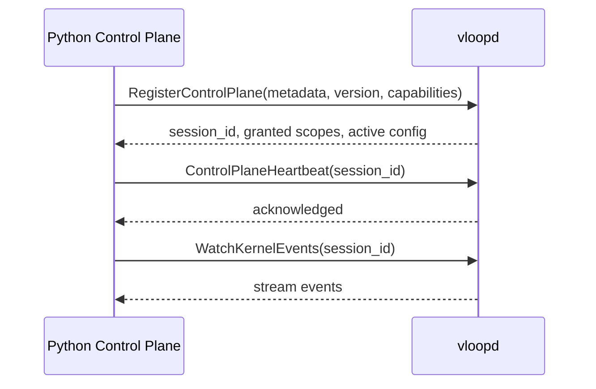

# Kernel IPC Specification

The kernel IPC layer is the trusted local communication path between the Rust kernel daemon and the Python Control Plane.

---

## 1. Goals

The IPC layer must provide:

- secure local-only communication;
- cross-platform behavior;
- explicit registration and session establishment;
- streaming for logs, events, and health;
- capability-based request authentication;
- bounded retries and timeouts.

---

## 2. Transport model

| OS | Transport |
|---|---|
| macOS | Unix domain socket |
| Linux | Unix domain socket |
| Windows | Named pipes or equivalent secure local transport |

Loopback TCP is not the production transport.

---

## 3. Trust model

The kernel is the server authority. The CP is the primary trusted client. IPC security should include:

- local-only transport;
- per-session or per-boot capability token;
- request metadata carrying request IDs and auth data;
- platform access controls on socket/pipe creation;
- structured audit records for privileged calls.

---

## 4. Registration flow

Registration should establish:

- CP identity for the current runtime session;
- configuration payload from kernel to CP;
- granted capability scope;
- event subscription eligibility.

---

## 5. IPC interaction classes

| Class | Pattern |
|---|---|
| control request | unary request/response |
| status query | unary request/response |
| logs | server streaming |
| events | server streaming |
| long-lived health/session | heartbeat / watch stream |

---

## 6. Timeouts and retries

- unary calls must have explicit deadlines;
- streaming calls must be resumable;
- CP reconnect should not require daemon restart;
- stale sessions must be invalidated after CP restart;
- request handlers should distinguish auth failure, dependency failure, resource failure, and internal error.

---

## 7. Platform requirements

### Unix

- runtime directory should be private to the user;
- socket creation must prevent unsafe reuse patterns;
- stale socket cleanup must be explicit and safe.

### Windows

- pipe security must restrict access to the expected user/session context;
- service-mode and user-session interactions must be compatible with UI opening semantics.

---

## 8. Validation requirements

The IPC layer is complete when:

- CP can register on all target OSes;
- auth metadata is enforced;
- log/event streams work under reconnect scenarios;
- failed or stale sessions are handled safely.
