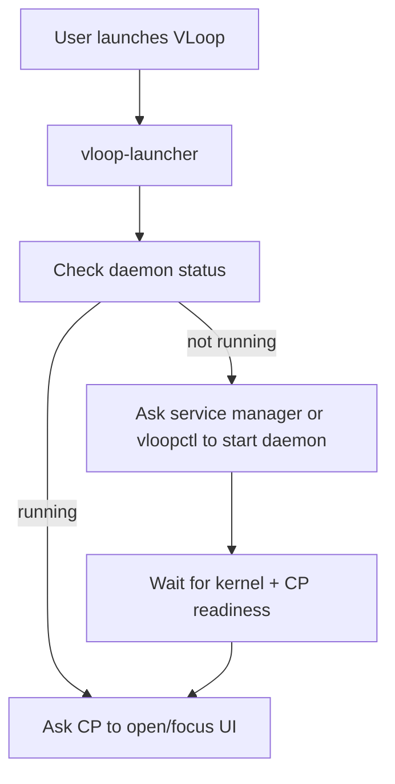

# `vloop-launcher` — User Launcher Specification

`vloop-launcher` is the user-facing executable attached to desktop shortcuts, Start Menu entries, dock/app icons, and similar entrypoints. Its job is to make VLoop feel like a normal desktop app even though the actual product is a daemon + control plane system.

---

## 1. Responsibilities

`vloop-launcher` should:

- ensure the background system is running;
- ask the Python Control Plane to open or focus the UI window;
- avoid showing a terminal window for normal operation;
- surface graceful failure messages when the daemon cannot start.

## 2. Non-responsibilities

It should **not**:

- implement service logic itself;
- own application state;
- bypass `vloopd` or `vloopctl`;
- contain business logic beyond launch orchestration.

---

## 3. Launch flow

---

## 4. UX expectations

- one click should open the app;
- repeated launches should focus the existing window instead of opening uncontrolled duplicates;
- if dependencies are missing, the launcher should route the user toward a clear support/doctor message;
- startup delays should be bounded and observable.

---

## 5. Platform integration

| OS | Launcher shape |
|---|---|
| macOS | App-style launcher wrapper or packaged binary target. |
| Windows | Start Menu / shortcut target that hides terminal behavior. |
| Linux | Desktop entry target. |

---

## 6. Failure handling

If the launcher cannot get the system ready, it should:

- attempt a single clean start path;
- wait a bounded amount of time;
- show a user-facing explanation or hand off to `vloopctl doctor`;
- avoid spawning uncontrolled duplicate daemons.

---

## 7. Completion criteria

`vloop-launcher` is complete when a non-technical user can treat VLoop like a normal desktop app entrypoint on all target operating systems.
