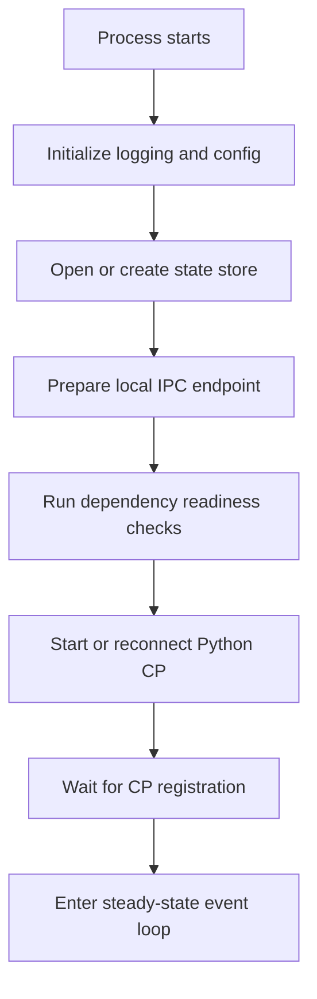

# `vloopd` — Rust Kernel Daemon Specification

`vloopd` is the infrastructure authority for VLoop. It is the single long-running process that owns local resources, local service integration, secure IPC, and the lifecycle of the Python Control Plane.

---

## 1. Responsibilities

`vloopd` is responsible for:

- booting as a background daemon through OS-native service mechanisms;
- exposing secure local IPC to the Python Control Plane;
- supervising the CP process and restarting it when necessary;
- managing workloads, filesystems, volumes, artifacts, databases, networking, secrets, and runtime dependencies;
- maintaining authoritative resource state and reconciliation loops;
- emitting health, events, logs, and audit trails;
- serving as the only infrastructure execution path for CP requests.

## 2. Non-responsibilities

`vloopd` does **not**:

- own user-facing windows;
- implement the agent planning logic;
- expose raw secret values to Python by default;
- require terminal interaction from the user;
- depend on Tauri or any GUI runtime.

---

## 3. Process modes

| Mode | Description |
|---|---|
| daemon mode | Normal background operation through LaunchAgent, Windows Service/scheduled-task fallback, or systemd user service. |
| foreground mode | Development/debug mode with logs to stdout. |
| install/uninstall integration | Invoked indirectly by `vloopctl` or installer scripts. |

---

## 4. Internal modules

| Module | Purpose |
|---|---|
| `daemon.rs` | Boot sequence, runtime composition, signal handling, graceful shutdown. |
| `ipc/` | Local IPC transport and auth. |
| `orchestrator/workload.rs` | Workload lifecycle, status, reconciliation, logs, exec, teardown. |
| `orchestrator/docker.rs` | Default local runtime backend. |
| `orchestrator/filesystem.rs` | Workspaces, volumes, artifacts, safe extraction, cleanup. |
| `orchestrator/database.rs` | SQLite/Postgres/Redis/vector-store provisioning and lifecycle. |
| `orchestrator/network.rs` | Ports, service routing, network policy, preview URLs. |
| `orchestrator/secrets.rs` | Secret storage, grants, injection, audit. |
| `orchestrator/dependencies.rs` | Docker/runtime dependency checks, CP config injection, doctor support. |
| `orchestrator/state.rs` | Durable kernel state. |
| `service/` | OS-native service registration and control. |

---

## 5. Startup sequence

### Required startup guarantees

- exactly one authoritative daemon instance per user/runtime root;
- local IPC endpoint is created with platform-appropriate access controls;
- CP is not considered healthy until it registers successfully;
- the daemon can continue operating long enough to emit a meaningful failure status when dependencies are missing.

---

## 6. Runtime directories

Recommended root: `~/.vloop/`

| Path | Purpose |
|---|---|
| `run/` | IPC endpoints, pid/lock files, temp runtime metadata. |
| `state/` | Durable resource state and reconciliation metadata. |
| `workspaces/` | Workflow workspaces. |
| `volumes/` | Managed reusable volumes. |
| `artifacts/` | Preserved workflow outputs. |
| `logs/` | Structured logs and debug bundles. |
| `db/` | SQLite files and managed local database state. |
| `cache/` | Images, tool caches, dependency caches where appropriate. |

---

## 7. Health model

`vloopd` should track at least these states:

- `starting`
- `ready`
- `degraded`
- `dependency_missing`
- `cp_unregistered`
- `cp_restarting`
- `shutting_down`

Health is exposed to:

- `vloopctl status`
- the CP registration path
- installer validation
- support diagnostics

---

## 8. Failure and recovery model

### CP failures

- detect process exit and registration timeout separately;
- restart with backoff;
- invalidate stale sessions/capabilities;
- preserve kernel-managed resources unless policy says otherwise.

### workload failures

- preserve logs, exit codes, and artifacts;
- keep reconciliation state authoritative;
- distinguish between workload failure and kernel failure.

### dependency failures

- surface them in `doctor` and status;
- keep daemon alive enough to present actionable diagnostics.

---

## 9. Observability requirements

`vloopd` should emit:

- structured logs;
- event/audit records;
- service lifecycle logs;
- workload status streams;
- dependency readiness state;
- CP registration and restart events.

---

## 10. Validation requirements

- boots in foreground mode on all OSes;
- creates local IPC securely;
- restarts CP correctly;
- reports dependency status through `vloopctl`;
- persists and reconciles kernel state;
- shuts down gracefully without orphaning child processes.
