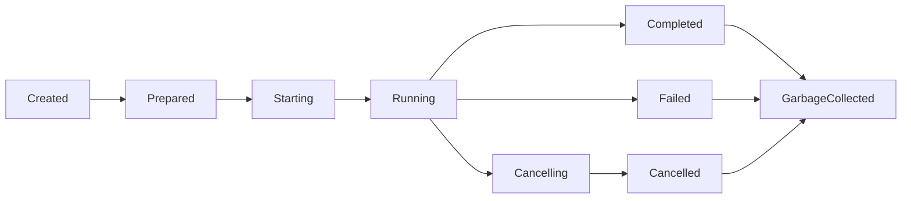

# Workload Orchestrator Specification

The workload orchestrator is the kernel subsystem that turns a CP request into a managed execution environment and keeps its lifecycle correct over time.

---

## 1. Responsibilities

- create workloads from typed specs;
- prepare workspaces, mounts, networks, secrets, and resource limits;
- start and monitor workloads;
- stream logs and status;
- expose ports and service metadata when needed;
- support cancellation, teardown, and cleanup;
- reconcile desired state after failures or restarts.

---

## 2. Workload classes

| Class | Purpose |
|---|---|
| harness | code-generation or agent harness workload |
| worker | arbitrary task execution workload |
| preview | user-visible UI/app preview workload |
| service | long-lived support service such as a local DB or vector runtime |

---

## 3. State machine

The kernel owns this state machine. The CP consumes it.

---

## 4. Required capabilities

A workload may need:

- a workspace;
- one or more managed mounts;
- network access or network denial;
- port exposure;
- one or more secret grants;
- attached database endpoints;
- log capture;
- artifact retention.

---

## 5. Reconciliation model

The orchestrator should maintain:

- desired state from the CP request;
- observed runtime state from the backend;
- recovery rules after kernel or CP interruption;
- garbage-collection rules for ephemeral resources.

Reconciliation must be idempotent.

---

## 6. Logs, events, and artifacts

For each workload the orchestrator should provide:

- status watch stream;
- stdout/stderr log stream;
- final exit code and termination reason;
- discovered ports and preview URL metadata;
- artifact listing or pointers where applicable.

---

## 7. Cancellation rules

Cancellation should:

- stop the runtime cleanly when possible;
- force-kill when required by timeout or health policy;
- preserve final diagnostic information;
- release grants, routes, and ephemeral mounts after teardown.

---

## 8. Validation requirements

The orchestrator is complete when:

- it can manage at least one Docker-backed worker workload end to end;
- logs and events stream correctly;
- restart/reconciliation logic prevents orphaned workloads from becoming invisible;
- teardown is reliable and observable.
